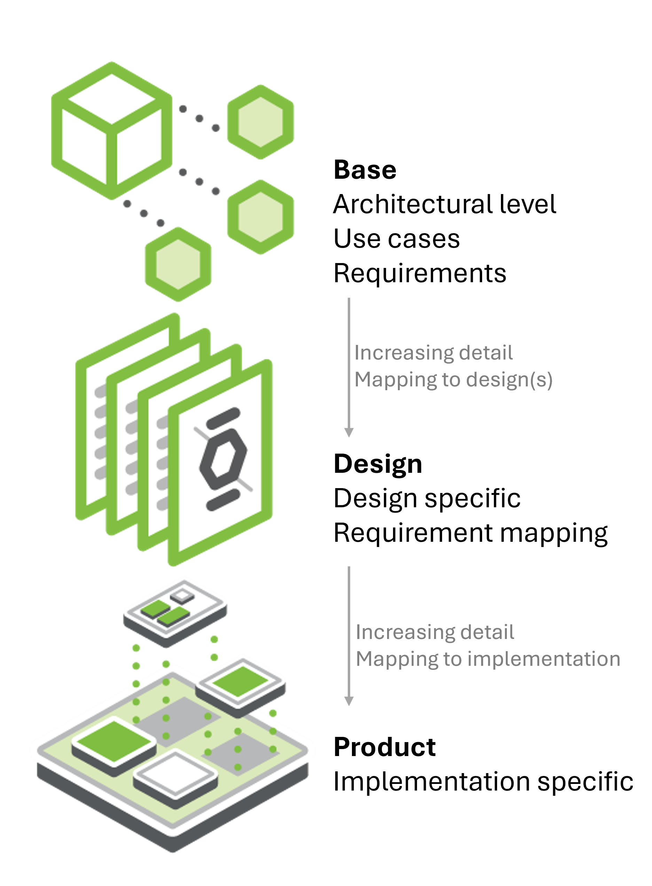

# Proposed Guidelines for OCP Specifications

Revision: 

Date:

---

# Version Table
| **Date** | **Revision** | **Author** | **Notes** |
| :---     | :---         | :---       | :---      |
| WIP      | WIP          | Russ Wunderlich (OCP) | see appendix for detailed WIP changes |
|          |              |            |           | 

---

# Table of Contents
  - [Version Table](#Version-table)
  - [Goal](#goal)
  - [Scope](#scope)
  - [Specification Usage and Types](#specification-usage-and-types)
  - [Guidelines](#guidelines)
    - [Language Convention](#language-convention)
    - [Vendor Information](#vendor-information)
    - [Citations](#citations)
    - [Versioning](#versioning)
    - [Normative Language](#normative-language)
  - [Project Review Guidelines and Checklist](#project-review-guidelines-and-checklist)
  - [Appendix - Detailed Change list](#appendix---detailed-change-list)

# Goal
The goal of this document is to provide the framework for OCP Specification contributions. 

This is a working version presenting an initial, evolving framework intended to establish alignment and guide future refinements.

# Scope
The framework will establish a common approach by aligning expectations, providing guidelines, and offering instructions for creating specification contributions.

- Expectations: Define what is required from contributors to meet specification standards.
- Guidelines: Outline the recommended structure and content for specifications.
- Instructions: Detail how to use the provided template to create and submit your specification.

# Specification Usage and Types
The scope of contributions within OCP is broad, ranging from silicon to systems, and from individual systems to complete data centers.
To enable specifications across this wide span, we start with high-level constructs and incorporate significant flexibility to accommodate diverse needs.

## Usages
For any framework to succeed, it must be grounded in a clear understanding of use cases. To guide the framework definition, three primary usage categories are identified:

1. Introduce a new technology/direction to the community
- Rapid decision making enabling quick release of a contribution
- Initial revision is typically sufficient for narrow, specific implementation
- May require additional community work to address broader needs 

2. Enabling a full ecosystem
- Builds on an existing baseline (any source), to evolve or define a specification for the broader ecosystem
- Expanded use cases and thorough vetting equates to a slower process
- Typically has stepping-stone approach, adding use cases with each revision 

3. Technology development/evolution
- Planned technology development requiring strong community engagement 
- Planned progression through multiple revisions (0.3, 0.5, 0.8, 1.0) to achieve final, implementable results
- Represents the slowest progression and highest detail level

These three usage categories apply across all levels, from architecture to implementation, and any contribution may align with each category throughout its revisions. When evaluating the framework, key considerations include:
- Detail level: Comprehensive specification details vs. “Good enough” specification
- Industry alignment: many specification are tightly aligned to industry standards and may need additional considerations
- Flexibility for innovation: Allowance for exploration w/o having a predefined roadmap

## Types
The three types or layers of OCP specifications are Base, Design, and Product.

Any or all of the layers could be utilized for any particular contribution.  
Examples:
- A base layer defines the architecture and requirements for a nuclear power source for an AI Datacenter. The subsequent design specification details how to meet the base requirements with specific design elements and more detailed requirements for a Molten Salt Reactor (MSR). The final specification, the product spec, provides the implementation details (and potentially manufacturing files) for the "MSRv5 Power Module", a fifth generation MSR from the Nuclear Are Us store. 
- The Nuclear Are Us store provides (only) a design specification in order to create a larger supplier base for the MSR.

### Base
The Base Specification is an architectural framework for coarse alignment providing requirements for flexible hardware and software modules/layers to interoperate. Market requirements drive Base Specifications. Without defining details of a specific design, the Base Specification may be light on IP content. This structure enables and simplifies the process for multiple parties (including potential competitors) to engage in this phase.

This layer defines the technical details for one of the following:
- Conceptual framework for an extensible technology platform/layer, representing technical community wide consensus and possibly used as a de-facto standard
- Requirements for a specific solution
- Extension/modification of an existing specification 

### Design
The design layer goes deeper than the architectural specification by detailing how the system will be implemented at the component and module level.

The Design Specifications has detail that further defines what specific role this contribution plays, and enough detailed design information such as high level board layouts etc that enables end users to begin the journey to realize this in the market. One or more parties may join to develop detailed design specs. Compared to the Base Specification, this effort typically contains significantly more detail such as IP-related information. 

Design Specifications are intended to foster multiple product specifications.

This document defines the technical details for one of the following types of specifications:
- Design Specification for an intended physical hardware product type
- Modification of an existing specification (state which existing spec is being modified)
- A specification with additional detail over the Base Specification for a product type.

### Product
The product layer is an implementation-level specification providing the exacting details of the end-product. 

The Product Specification captures manufacturing requirements including all design and build files, building on the Design Specification. 

This document defines the technical details for one of the following types of specifications:
- Product Specification for an intended physical hardware product type
- Modification of an existing product specification
- A detailed specification for a product type

<!-- think about putting a spec decision tree for choosing the specification type -->

# Guidelines
## Language Convention
All specifications shall be written in English, and any recognized variant of English spelling (e.g., British, American, Canadian, Australian) is acceptable, provided usage is consistent within each document.

## Vendor Information

1. **Neutral Treatment of Vendors**  
Vendors must not be promoted or demoted in any documentation, communication, or system configuration.
2. **Component References**  
Specific vendor components should not be explicitly named. When necessary, use generic phrasing such as “a component like XYZ”, "component XYZ or equivalent", or entertain enabling a component specification that does not favor a particular vendor.

## Citations
All citations must reference published documents. Authors shall not cite documents that have not yet been published. For multiple related OCP specifications, cross-referencing is acceptable provided that all referenced specifications have initiated the submission process to the contribution hub.

## Use of Non-OCP Document Information
**General Principle**  
All specifications must include only materials for which the organization holds the necessary usage rights or that are legally available for free and unrestricted use.

**Best Practices**
- Prefer Referencing Over Incorporation  
Whenever possible, reference external material rather than embedding it directly in the specification. 
- Avoid Version Lock-In  
Referencing helps prevent binding the specification to a specific version unless absolutely required. 

**When Inclusion Is Necessary** 
- Use Original Wording  
Describe the information in your own words whenever possible. 
- If Direct Inclusion Is Required  
Clearly state the source of the material.  
Ensure all legal and usage requirements are met (e.g., copyright notices, required attribution). 

**Permitted Sources**  
Examples of allowed sources include:
- Apache 
- OIF 
- MIL-SPEC 

## Modification of non-OCP industry standards
ToDo: complete this section

question: Is there a better process to address OCP specification questions than an email to the project group.io?

## Versioning
Versioning shall follow the format: **Major.minor.patch/errata (M.m.p)**

Increment Rules:
- Major: large functionality changes that may be incompatible with prior major version  
- minor: Adding functionality in a backward compatible manner  
- patch/errata: backward compatible corrections  

Currently, SW shall use the patch version. All other usages shall have errata = 0 until an errata process is established.

Guidelines for usage:   
V0.3.0 = initial version with  sufficient content (e.g., TOC, vision, scope ...) to enable alignment  
V0.5.0 = majority of content defined; some areas need additional detail  
V0.8.0 = definition complete and implementable, though not fully reviewed  
V1.0.0 = reviewed and implementable across all capabilities  
V1.x.0 = use minor revisions for backward compatible changes. 
V2.x.0 = use Major revisions for changes that may affect backward compatibility.  

Additional Notes
- Initial development is indicated Major = 0 (0.m.p) and any content may change at any time
- Additional revisions between the designated milestones are allowed but generally discouraged
- Versioning only increments; it never decrements
- Versioning uses only non-negative integers
- Any version statement in the specification name is part of the name, not the version (e.g. Recliner V1 V1.0.0, Recliner V2 V1.1.0)

## Normative Language
Normative language establishes clear, enforceable requirements and removes ambiguity. Requirements are the basis for compliance.

- Shall = requirement  
Requirements are mandatory, must be done.  
Including the word “not” (as in shall not) specifies a mandatory prohibition, meaning the requirement explicitly forbids the action.

- Should = recommendation  
Recommendations are optional yet indicate a preferred direction if implemented  
Including the word “not” (as in should not) indicates a strong recommendation against performing an action  

- May = allowable  
Indicates flexibility of choice (option) with no implied preference.

Normative language shall be invariant to capitalization.

**All specifications shall utilize normative language.** 

## Information outside of specification scope
Maintaining consistency within specifications is critical to ensuring quality. Authors sometimes wish to include additional information that falls outside the approved specification template or does not align with its intended purpose.

**No content beyond the defined template structure shall be added.**
The template provides flexibility for including supplementary details in the appendix section.

# Project Review Guidelines and Checklist
## Guidelines
Define a minimal process & checklist that each workstream executes prior to contribution hub submittal  
Checklist submitted with contribution  

Expectations
- Fully inclusive with defined minimum set of reviewers
- Invitations to dependent/adjacent workstreams
- All feedback tracked & dispositioned

Final form verified to requirements before uploading to contribution hub

ToDo: develop checklist

# Appendix - detailed Change list
This section will be more a detailed direction enumeration than an explicit change list in order to help overall changes & direction for feedback.  

**2025/12/10**
- Errata updates are suspended while we investigate usage (details available on the wiki).
- publish a proposed base template which is a blank template with instructions as a separate document. The purpose is to ensure the template clearly displays the mandatory sections as well as shows the lack of mandate (flexibility) within the body.
- Specification Guidelines serve as the framework for expectation alignment (i.e., mandates)
  - Normative language is required.
  - Revisioning is simplified.
  - The compliance section has been removed. This does not mean specifications will lack compliance requirements; rather, the format is under discussion. If requirement language is mandated, compliance becomes a summary of those requirements. (Status: WIP)
  - The requirement for product specifications to include design file contributions has been omitted. The community has not consistently followed this guidance, and its role needs to be reconsidered within the broader scope of contributions.
  - Additional guidance has been added for aspects such as vendor language and references.
- major items currently under investigation
  - Compliance as noted above
  - Language for Base/Design/Product layers. Current wording in the guidelines originates from the 2022 definition effort. Since then, OCP’s scope has expanded significantly. The language and definitions are under review to ensure they align with and define the full scope of OCP, including considerations like design file inclusion.
  - Specification format. We aim to fully support a Markdown-based* workflow within OCP and encourage its use. However, it is unclear whether this will work for all specification contributions. We are investigating supported formats (Markdown, LaTeX, DOCX, PDF, etc.). *Note: Some contributors prefer Markdown with rendering flows, while others favor LaTeX. We are evaluating all options.