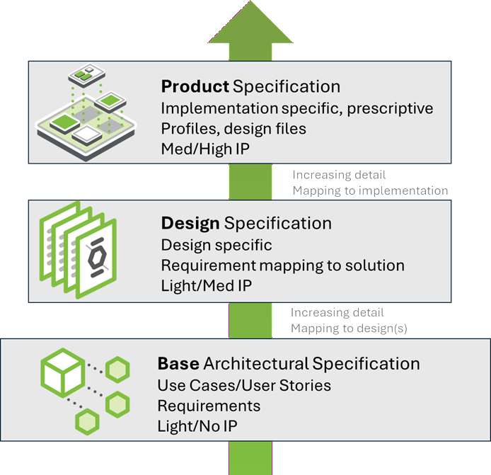

**Revision History**

| Revision | Date       | Author(s)    | Description                     |
| :---     | :---       | :---         | :---                            |
| WIP      | WIP          | Russ Wunderlich (OCP) | see appendix for detailed WIP changes |
| xx       | YYYY/MM/dd | Names(s)     | Text                            |

---  

```{=latex}
\linenumbers
```   

# Goal
The purpose of this document is to define the framework for OCP Specification contributions. It complements the specification template, associated guidance, and the Contribution Taxonomy by providing additional depth, clarity, and specificity.  

This is a working version presenting an evolving framework intended to establish alignment and guide future refinements.  **FEEDBACK IS GREATLY APPRECIATED**

# Scope
The framework establishes a common approach by aligning expectations, providing guidelines, and offering instructions for creating specification contributions.

- Expectations: Define what is required from contributors to meet specification standards.
- Guidelines: Outline the recommended structure, mapping, and content for specifications.
- Instructions: Describe how to use the provided template to create and submit a specification. The template and the instructions are provided as separate documents.  
  
# Specification Usage and Types
The scope of contributions within OCP is broad, spanning from silicon to complete systems, and from individual components to full data center implementations. To support specifications across this wide spectrum, the framework begins with high-level constructs and incorporates sufficient flexibility to accommodate diverse use cases and requirements.  

This approach aligns with a specification template that focuses on the core framework, supported by complementary instructions and guidelines.

## Usages
For any framework to succeed, it must be grounded in a clear understanding of use cases. To guide the framework definition, three primary usage categories are identified:

1. Introduce a new technology/direction to the community
- Rapid decision making enabling quick release of a contribution
- Initial revision is typically sufficient for narrow, specific implementation
- May require additional community work to address broader needs 

2. Enabling a full ecosystem
- Builds on an existing baseline (any source), to evolve or define a specification for the broader ecosystem
- Expanded use cases and thorough vetting equates to a slower process
- Typically has stepping-stone approach, adding use cases with each revision 

3. Technology development/evolution
- Planned technology development requiring strong community engagement 
- Planned progression through multiple revisions (0.5, 0.8, 1.0, 2.0) to achieve final, implementable results
- Represents the slowest progression and highest detail level

These three usage categories apply across all levels, from architecture to implementation, and any contribution may align with each category throughout its revisions. When evaluating the framework, key considerations include:  

- Detail level: Comprehensive specification details vs. “Good enough” specification
- Industry alignment: many specification are tightly aligned to industry standards and may need additional considerations
- Flexibility for innovation: Allowance for exploration w/o having a predefined roadmap

## Types
The three types (or layers) of OCP specifications are: Base, Design, and Product.



Any or all of the layers could be utilized for any particular contribution.  

Table: Focus {#tbl:Focus}
| **Spec Type**             | **Focus**                           |
| :---                      | :---                                | 
| Requirements Document[^1] | What the system must do             | 
| Architecture spec         | High-level structure and principles |
| Design spec               | How the system will be built        |
| Product/Implementation    | Actual code/configuration/design    |

[^1] Not a specification but a document of requirements that may precede a specification

### Base
The Base Specification is the highest level of definition intended to provide an architectural framework for alignment. Based on Use Cases/User Stories/market requirements, the Base Specification provides the intent (or vision), requirements, and constraints for hardware and/or software modules/layers to interoperate. The Base Specification may be light on IP content which potentially allows for broader Community engagement. 

A base spec may contain:  

- A vision, purpose, and scope
- Architecture Principles
- High-Level Architecture definition
- Detailed architecture (multiple layers possible)
- Assumptions and constraints
- Non-Functional Requirements
- Compliance 
This definition can be applied for both software and hardware, either stand-alone or in combination, and at many levels. 

The base layer generally defines the technical details for one of the following:  

- Conceptual framework for an extensible technology platform/layer, representing technical community wide consensus and used as a de-facto standard
- Definition and requirements for a specific solution
- Extension/modification of an existing specification 

### Design
The design layer satisfies the architectural specification by detailing how the system will be implemented at the next level (component, module, API etc.). The Design Specification has detail that further defines what specific role this contribution plays, and enough detailed design information that enables end users to begin the journey to realize this in the market. One or more parties may join to develop detailed design specs. Compared to the Base Specification, the design layer typically contains significantly more detail and IP. 

A design spec may contain:  

- Purpose and Scope
- Requirements Traceability
- Design Overview
- Design Details
- assumptions and constraints
- Non-Functional Design Considerations
- Verification and validation

Design Specifications are intended to foster multiple product specifications.

The design layer generally defines the technical details for one of the following:  

- An intended physical hardware or software product type
- Modification of an existing specification (state which existing spec is being modified)
- Extension/modification of an existing specification 


### Product
The product layer is an implementation-level specification providing the exacting details of the end-product. The Product Specification captures manufacturing requirements including all design and build files which satisfy the Design Specification. 

A product spec may contain:  

- Purpose and Scope
- Requirements Traceability
- Product Overview
- Product Details
- Manufacturing details


The product layer generally defines the technical details for one of the following:  

- an implemented hardware or Software product
- Modification of an existing product specification (also known as Profile or Profile layer)

## Naming Conventions
With the broad span of OCP specification needs, the naming of a specification becomes more difficult.  The concept here is to define a contribution type per OCP definition (Base, Design, or Product) yet allow for the tailored language needed for the usage.

***Also-Known-As Examples***  

- Base Specification:  
  - Architectural Specification
  - System Architecture Specification
  - Platform Architecture Specification
  - Hardware Architecture Specification
  - Software Architecture Specification
  - Solution Architecture
  - Interconnect Architecture
  - Network Architecture Specification
  - Functional Architecture Document
  - End-to-End System Architecture
  - Fabric Architecture (e.g., switching fabrics, NoC)  
  
- Design Specification:  
  - Component Specification
  - Module Specification
  - Detailed Design Specification (DDS)
  - Interface Specification
  - Protocol Specification
  - Transport Specification
  - API Specification
  - Microarchitecture Specification
  - Firmware Design Specification
  - Hardware Design Specification
  - Software Design Specification
  - Timing Specification
  - Power/Performance Specification (PPA spec in silicon)
  - Data Path Specification
  - Control Path Specification
  - Memory Map Specification
  - Register Map Specification
  - IO Specification
  - PHY Specification
  - SerDes Specification
  - Clocking & Reset Specification  
  
- Product Specification:  
  -  Implementation Specification
  -  *Product Name* Specification

Note: A *Profile Specification* (or profile) is another term that can be utilized at both the design and product level. A profile is a constrained and/or extended version of an existing specification designed to meet the needs of a specific application or environment.

**To be done**: Need to think through test/val & manuf side to understand mapping. seems like there is a perceived need (there are white papers doing this) for a distinct Test & Val contribution.

<!-- think about putting a spec decision tree for choosing the specification type -->
## Examples  
These examples illustrate the range of uses of the layered definition. They are not exhaustive and may simplify real-world implementations.

1. Small Modular Reactor Workflow
- Architecture Spec (High-level structure and principles)  
The OCP Community identifies a need for small-scale, modular nuclear power and defines a shared architecture and requirements.  
System goals: Small-scale generation, factory-built modularity, passive safety, reduced operator dependency  
Architecture & requirements: Reactor type, integrated primary system, passive safety systems, plant layout  
Key principles: Passive safety, modularity, simplification, scalability  

- Design Spec (How the system will be built)  
The OCP Community develops technology-specific design specifications (e.g., MSR, HTGR, LWR) to realize the architecture.
Reactor core: Fuel type, geometry, refueling intervals  
Thermal-hydraulics: Coolant flow, heat transfer, operating conditions  
Structures: Pressure vessel, containment concepts  
Systems: Safety, control, protection, instrumentation, regulatory compliance  

- Implementation (Actual code/configuration/design)  
Vendors contribute implementable designs aligned to the specs (e.g., “MSRv5 Power Module”).  
Design artifacts: 3D CAD, P&IDs, BOMs  
Control systems: Reactor control software  

2. Silicon Design Workflow
- Architecture Spec (High-level structure and principles)  
The OCP Community defines shared compute architecture targets to meet workload and efficiency needs.  
System goals: Performance, power, process node, target workloads  
Architecture: Compute mix, memory hierarchy, interconnect  
Principles: Parallelism, power/performance tradeoffs, modularity  

- Design Spec (How the system will be built)  
The OCP Community specifies microarchitectures and interfaces to enable interoperable designs.  
Microarchitecture: Pipelines, execution units, caches  
Interfaces: Protocols, clock domains  
Constraints: Floorplan, power, timing  
Verification: Coverage, simulation, testbenches  

- Implementation (Actual code/configuration/design)  
Contributors implement silicon components aligned to the specifications.  
Design: RTL for devices or chiplets  
Physical: Layout files (GDSII/OASIS)  

3. CDU (Cooling Distribution Unit) Workflow
- Architecture Spec (High-level structure and principles)  
The OCP Community defines a common cooling approach for high-density systems.  
Approach: Liquid cooling (direct-to-chip, immersion-ready)  
Goals: Heat capacity, redundancy, form factor  
Principles: Efficiency, reliability, serviceability, scalability  

- Design Spec (How the system will be built)  
The OCP Community creates detailed cooling system designs and component requirements.  
Hydraulics: Pump sizing, flow, pressure  
Thermal: Heat exchangers, coolant properties  
Control: Sensors, control logic  
Mechanical: Piping, manifolds, valves  
Safety: Leak detection, shutdown  

- Implementation (Actual code/configuration/design)  
Vendors deliver deployable CDU systems based on the specifications.  
Artifacts: CAD models, BOMs  
Control: Firmware/PLC programming  
Delivery: Assembly, installation, commissioning  

4. Power Delivery Workflow
- Architecture Spec (High-level structure and principles)  
The OCP Community defines a scalable and resilient power delivery hierarchy.  
Hierarchy: Utility → UPS → PDU → rack → board  
Requirements: Load capacity, redundancy, safety, security  
Principles: Efficiency, resiliency, modularity  

- Design Spec (How the system will be built)  
The OCP Community specifies electrical distribution and protection strategies.  
Electrical: Voltage levels, transformers, rectifiers  
Distribution: Busbars, cabling, breakers  
Protection: Grounding, surge, fault isolation  
Monitoring: Telemetry, management integration  
Compliance: Standards alignment  

- Implementation (Actual code/configuration/design)  
Manufacturers implement power systems conforming to OCP specifications.  
Artifacts: Schematics, PCB designs  
Control: Monitoring firmware  
Validation: Testing, commissioning  

5. CXL-Attached Memory Management API Workflow
- Architecture Spec (High-level structure and principles)  
The OCP Community defines a composable memory architecture using CXL.  
System goals: Memory pooling, tiering, performance optimization  
Architecture: Root complex, CXL devices, memory pool manager, API layer  
Principles: Disaggregation, controllability, QoS, isolation  

- Design Spec (How the system will be built)  
The OCP Community defines APIs and system integration models.  
API: Allocation, policy, telemetry interfaces  
Integration: Kernel, user space, orchestration  
Management: Partitioning, fragmentation, migration  

- Implementation (Actual code/configuration/design)  
Contributors implement software stacks and APIs aligned to the spec.  
Software: API libraries, kernel extensions  
Platform: Drivers, firmware  
Control: Management and orchestration software  

# Guidelines  

## Template & Formatting    
The most current specification template shall be used for all contributions. Once a contribution enters the submission process, defined by acceptance of its abstract, it is thereafter fixed to the template version in effect at that time. Contributors may elect to update to a later template version but shall not revert to an earlier version.

Blank pages shall not be included in the specification. Any page that would otherwise be blank due to document pagination must either be removed or, if intentionally required, clearly marked with the statement: “This page intentionally left blank.”

### Language Convention
All specifications shall be written in English, and any recognized variant of English spelling (e.g., British, American, Canadian, Australian) is acceptable, provided usage is consistent within each document.


### Versioning
Versioning shall follow the format: **Major.minor.patch/errata (M.m.p)**

Increment Rules:

- Major: large functionality changes that may be incompatible with prior major version  
- minor: Adding functionality in a backward compatible manner  
- patch/errata: backward compatible corrections


Currently, SW shall use the patch version. All other usages shall have errata = 0 until an errata process is established.

Guidelines for usage:  

- V0.3.0 = initial version with  sufficient content (e.g., TOC, vision, scope ...) to enable alignment  
- V0.5.0 = majority of content defined; some areas need additional detail  
- V0.8.0 = definition complete and implementable, though not fully reviewed  
- V1.0.0 = reviewed and implementable across all capabilities  
- V1.x.0 = use minor revisions for backward compatible changes. 
- V2.x.0 = use Major revisions for changes that may affect backward compatibility.  

Additional Notes:  

- Initial development is indicated by Major = 0 (0.m.p) and any content may change at any time  
- Additional revisions between the designated milestones are allowed but generally discouraged  
- Versioning only increments; it never decrements  
- Versioning uses only non-negative integers  
- Regarding "complete and implementable", it is acceptable for a version to include elements intended for future definition, provided these elements do not hinder the implementation of the features and functionality defined within the current version  
- Any numbering statement in the specification name is part of the name, not the version (e.g. Recliner V1 V1.0.0, Recliner V2 V1.2.0)
- Authors are free to append "DRAFT", "Release Candidate", "RC #", or other indications of status in working versions.  The final version shall remove this language.

**To be done**: Establish Errata process/guidelines

### Information outside of specification scope
Maintaining consistency within specifications is critical to ensuring quality. Authors may wish to include additional information that falls outside the approved specification template or does not align with its intended purpose.

**No content beyond the defined template structure shall be added.**  
The template provides flexibility for content including supplementary details in the appendix section.  

**To be done**: resolve CLA not including the appendix

## Modification of non-OCP industry standards 
This section will be completed in Q3 update.  
**To be done**: This section needs to be completed


<!-- should add in guidelines re interfacing with other standard bodies. i.e., have member that is in project interfacing & gaining alignment with other std body (DMTF, PCI...) -->

<!-- Modification of industry standard disallowed, must request change to the industry standard. Compliance.  Augmentation allowed. configuration/profiles, or otherwise selecting feature is acceptable as long as it remains compliant to the standard. -->

<!-- question: Is there a better process to address OCP specification questions than an email to the project group.io? -->


## Normative Language
**All specifications shall utilize normative language.**   

Normative language establishes clear, enforceable requirements and removes ambiguity. Normative language enables requirements which are the basis for compliance.

- Shall = requirement  
Requirements are mandatory, must be done.  
Including the word “not” (as in shall not) specifies a mandatory prohibition, meaning the requirement explicitly forbids the action.

- Should = recommendation  
Recommendations are optional yet indicate a preferred direction if implemented  
Including the word “not” (as in should not) indicates a strong recommendation against performing an action  

- May = allowable  
Indicates flexibility of choice (option) with no implied preference.

Normative language shall be invariant to capitalization. This was chosen for simplicity as most authors do not rigorously follow the "all capitalized" standard. Authors following the invariant to capitalization guideline SHALL NOT use the keywords in their normal English meanings.   

The normative language above was selected for consistency and ease of implementation. This guidance is not intended to be restrictive. Conformance with the terminology defined in IETF RFCs 2119 and 8174 is acceptable.  
Regardless of capitalization choices, the selected convention must be documented in the "Conventions" section and applied uniformly throughout the document.

**To be done**: align and add in requirements guidelines

## References
**All references must be to published documents. Authors shall not reference documents that have not yet been published.**  

For multiple related OCP specifications being developed simultaneously, cross-referencing is permitted provided that all referenced specifications have initiated the submission process to the Contribution Hub and will be submitted <u>for approval</u> no greater than three months apart.  
 
It is strongly preferred that specifications not reference documents stored on an OCP Google Drive, as those documents may be transient. Instead, the preferred approach is to release the document as an associated contribution and use the Google Drive–hosted version only for work-in-progress material. Another preferred option is to place the associated documentation in an OCP GitHub repository and reference that repository from the specification.

## Use of Non-OCP Materials
**General Principle**  
All specifications must include only materials for which the organization holds the necessary usage rights or that are legally available for free and unrestricted use.

**Best Practices**  

- Prefer Referencing Over Incorporation  
Whenever possible, reference external material rather than embedding it directly in the specification  
- Avoid Version Lock-In  
Referencing helps prevent binding the specification to a specific version/content unless absolutely required. 

**When Inclusion Is Necessary**  

- Use Original Wording  
Describe the information in your own words whenever possible as summarizing is safe. 
- If Direct Inclusion Is Required  
Clearly state the source of the material.  
Ensure all legal and usage requirements are met (e.g., copyright notices, required attribution). 

## Vendor Information
1. **Neutral Treatment of Vendors**  
All specifications shall treat vendors in a strictly neutral manner. Vendors must not be explicitly or implicitly promoted, preferred, endorsed, or disparaged.
Specifications should avoid references that could be interpreted as favoring a particular supplier, brand, product line, or proprietary implementation. Language, examples, and diagrams must be written to reflect functional or performance-based **requirements** rather than vendor-specific solutions.  
Where examples are provided for clarity, they must be clearly identified as illustrative only and must not imply recommendation, certification, or exclusion of alternative solutions. Consistent neutral terminology should be used throughout to reinforce fairness, transparency, and equal opportunity for all compliant vendors.  
  

2. **Component References and Sourcing**
To the greatest extent practicable, specifications should avoid recommending or requiring components or technologies that can be sourced from only a single vendor. Requirements should be expressed in terms of measurable performance characteristics, functional capabilities, interfaces, and compliance with open or widely adopted standards.  
When use of a sole-sourced or proprietary component is unavoidable due to technical, regulatory, or compatibility constraints, the specification should:
- Use neutral, non-branded language such as “component XYZ or equivalent,” and
- Clearly define the minimum functional, performance, and interoperability criteria an equivalent component must meet.  

Where feasible, authors should define component specifications or interface requirements that allow multiple vendors to provide compliant implementations. This approach promotes competition, encourages innovation, reduces vendor lock-in, and supports long-term sustainability of the specification.  
Any constraints that limit multi-vendor sourcing should be explicitly documented, including the rationale and any anticipated plans to remove or mitigate such limitations in future revisions.

Examples of neutral references:  

- [component] meeting the specified requirements are listed below:  
- Acceptable [components] include, but are not limited to, the following:

## Compliance
This section will be completed in Q3 update.  
**To be done**: This section needs to be completed  

The compliance section is intended to summarize the requirements such that it is clear how "satisfying the requirement" is measured. Generally this is simply a summation in the form of a traceability matrix.

Table: Example Traceability Matrix {#tbl:TR_Matrix}
| **ID** | **Requirement**                           | **Type** | **Satisfies** | **Verification** | **Modality** |
| :---   | :---                                      | :---      | :---         | :---             | :---      |  
| SYS-12 | The vehicle shall accelerate from 0–60 mph in ≤ 8.0 seconds under standard test conditions             | System | Customer need: performance & drivability | Vehicle acceleration test (instrumented track measurement) | Mandatory |  
| PWR-3  | The powertrain shall deliver a minimum of 150 hp while maintaining fuel efficiency ≥ 30 mpg (combined) | Power  | SYS-12 | Dynamometer testing and fuel economy test (EPA cycle) | Mandatory |  
| ID-4   | The vehicle exterior design shall comply with aerodynamic drag coefficient ≤ 0.30                      | ID     | SYS-12 | Wind tunnel testing | Recommended |  
| ID-7   | The vehicle exterior design shall maintain brand styling guidelines                                    | ID     | Business need: brand Guidelines | design review approval | Optional |  

Modality: Mandatory, Optional, Recommended

## GitHub  
The following guidelines, together with applicable OCP IT policies, define the expectations for software contributions that incorporate GitHub‑sourced repositories.  

### Licensing Requirements  
- All repositories incorporated into an OCP contribution **SHALL** use a license included in the OCP‑approved software licenses list (insert link to official list).  
  - Note that OCP specification follow the appropriate contribution license which may not align with the software license list.  
- Contributors **SHALL NOT** rely on repositories with ambiguous, proprietary, or incompatible licenses.  

### Preferred Repository Hosting
- It is **strongly preferred** that contributors use repositories under the official [OCP GitHub hierarchy](https://github.com/opencomputeproject). 
- Use of non‑OCP GitHub repositories is acceptable when:
  - The repository uses an OCP‑approved license, and
  - The contributor evaluates long‑term maintenance, availability, and lifecycle risks. 
- For long‑term viability, contributors **should** consider pulling non‑OCP sources into an appropriate OCP repository especially when:  
  - it supports stability,
  - Customization or patches are anticipated, or
  - Dependency longevity is critical.
  
### Repository Content
Repositories should contain only material that is covered by, and permitted under, the repository’s chosen license.  

Repositories must not include confidential, proprietary, restricted, or otherwise non-public information belonging to any organization, company, individual, or third party. 

Contributors are responsible for ensuring that all submitted content is either their own original work, properly licensed for inclusion, or otherwise authorized for use and redistribution under the repository’s license. Any content with unclear ownership, licensing restrictions, or confidentiality concerns should not be added to the repository until the issue has been reviewed and resolved.

### Specifications
Specifications have a defined process and associated templates. Any specifications hosted from repositories **shall**:  

- align to/follow the appropriate specification template.  
This **shall** be measured via the PDF rendering submitted for the contribution  
<!-- update when we align to a specific rendering flow or allow md preview -->
- Maintain version control per the specification process.  
The version **shall** use a tag for the specific version. 

### Repository Documentation Requirements
Every repository referenced within a contribution **SHALL** include a README.md (or similar file) containing at minimum:  

- Repository Description    
A clear statement of purpose and how the repository is used within the contribution.
- Internal and external dependencies  
- Repository Hierarchy / Structure  
Explanation of directory layout, modules, or tooling (if applicable).  
- Dependencies on OCP‑Approved Contributions  
Include links to relevant OCP specifications or contribution database entries.  
- Contact Information (leads or support channels) as appropriate  
  
### No Guidelines
No guidelines are provided for the following:  

- workflow or branching model other than statements already made  
- repository structure  
- rate of development or maintenance 

# Project Review Guidelines and Checklist
## Guidelines
This section will be completed in Q3 update. 

**To be done**   Define a minimal process & checklist that each workstream executes prior to contribution hub submittal. Checklist submitted with contribution.  

Expectations  

- Fully inclusive with defined minimum set of reviewers (content experts)  
- Invitations to dependent/adjacent workstreams  
- All feedback tracked & dispositioned

Final form verified to requirements before uploading to contribution hub


## OCP Foundation Staff Review

OCP staff review specifications not only for alignment with the approved templates and guidelines but also for technical accuracy. Staff feedback is organized into the following categories:  

- **Required**  
Indicates feedback that must be addressed before the specification can advance to the next approval phase. This typically reflects non‑conformance to templates or guidelines, or a significant issue within the specification itself.  
- **Recommended**  
Indicates feedback that should be addressed to improve the overall quality, clarity, and usability of the specification.  
- **Suggested**  
Optional feedback intended to enhance clarity or usability, but not essential for approval.  
- **Comment**  
Captures all other observations, including occasional questions, often related to consistency or clarification needs. While questions are generally avoided at the staff‑review level, they may arise. Authors may determine if and how to address comments in this category.  

**AI Content**  
We encourage authors to use AI tools in their workflows to improve accuracy, enhance completeness, and reduce turnaround time. However, authors remain fully responsible for their content, and submissions that rely on low-quality or unedited AI-generated material may be rejected.

# Rendering Flow
**To be done**: This section needs to be completed  

**To be done**   This section will document any additional guidelines necessary for the OCP specification rendering flow

---
\beginappendices  

# Detailed Change list
This section will be more a detailed direction enumeration than an explicit change list in order to help overall changes & direction for feedback.  

**2025/12/10**  

- Errata updates are suspended while we investigate usage (details available on the wiki).
- publish a proposed base template which is a blank template with instructions as a separate document. The purpose is to ensure the template clearly displays the mandatory sections as well as shows the lack of mandate (flexibility) within the body.
- Specification Guidelines serve as the framework for expectation alignment (i.e., mandates)
  - Normative language is required.
  - Versioning is simplified.
  - The compliance section has been removed. This does not mean specifications will lack compliance requirements; rather, the format is under discussion. If requirement language is mandated, compliance becomes a summary of those requirements. (Status: WIP)
  - The requirement for product specifications to include design file contributions has been omitted. The community has not consistently followed this guidance, and its role needs to be reconsidered within the broader scope of contributions.
  - Additional guidance has been added for aspects such as vendor language and references.
- major items currently under investigation
  - Compliance as noted above
  - Language for Base/Design/Product layers. Current wording in the guidelines originates from the 2022 definition effort. Since then, OCP’s scope has expanded significantly. The language and definitions are under review to ensure they align with and define the full scope of OCP, including considerations like design file inclusion.
  - Specification format. We aim to fully support a Markdown-based* workflow within OCP and encourage its use. However, it is unclear whether this will work for all specification contributions. We are investigating supported formats (Markdown, LaTeX, DOCX, PDF, etc.). *Note: Some contributors prefer Markdown with rendering flows, while others favor LaTeX. We are evaluating all options.

**2026/03/10**
Compilation of the more significant additions/changes since last entry  

- added Foundation staff review information
- Various clarification made in guideline
- Various formatting changes
- added GitHub Guidelines. misc formatting changes (ex. alpha order), reverted Citations to References
- updated reference section with three month rule
- updated component reference wording
- added a Copyright/Trademark section
- reverted Versioning to existing Major.minor.patch format with updated guidelines
- added a detailed change list to guidelines

**2026/05/10**  

- Converted to rendering format
- strengthened the vendor neutrality language  

**2026/05/28**  

- document structure clean-up 
- deleted permitted sources section as this was not going to work (never be complete)
- aligned template & instructions headers
- reworded and expanded the specification types section 
- expanded examples of spec usages
- worked on formatting consistency

**2026/06/11**  

- prepped document for Community review cycle (consistent wording for areas that still need completion, removed or made comments work to be done aspects ...)
- added compliance section back in to align with the template