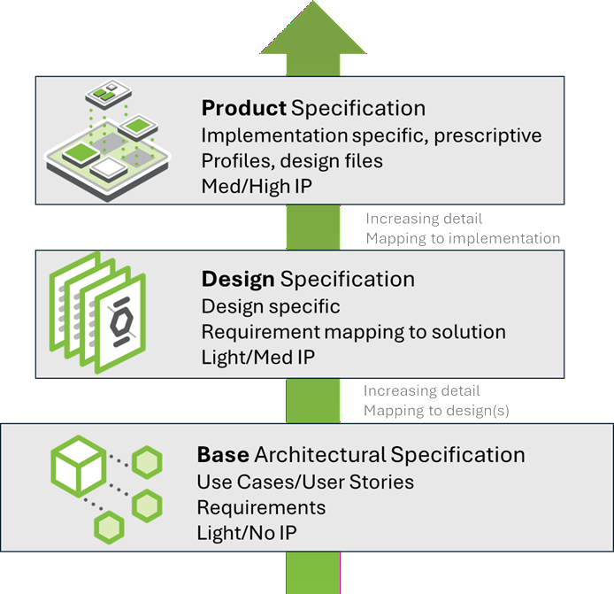

**Revision History**

| Revision | Date       | Author(s)    | Description                     |
| :---     | :---       | :---         | :---                            |
| WIP      | WIP          | Russ Wunderlich (OCP) | see appendix for detailed WIP changes |
| xx       | YYYY/MM/dd | Names(s)     | Text                            |

---  

```{=latex}
\linenumbers
```   

# Goal
The purpose of this document is to define the framework for OCP Specification contributions. It complements the specification template, associated guidance, and the Contribution Taxonomy by providing additional depth, clarity, and specificity.  

This is a working version presenting an evolving framework intended to establish alignment and guide future refinements.  **FEEDBACK IS GREATLY APPRECIATED**

# Scope
The framework establishes a common approach by aligning expectations, providing guidelines, and offering instructions for creating specification contributions.

- Expectations: Define what is required from contributors to meet specification standards.
- Guidelines: Outline the recommended structure, mapping, and content for specifications.
- Instructions: Describe how to use the provided template to create and submit a specification. The template and the instructions are provided as separate documents.  
  
# Specification Usage and Types
The scope of contributions within OCP is broad, spanning from silicon to complete systems, and from individual components to full data center implementations. To support specifications across this wide spectrum, the framework begins with high-level constructs and incorporates sufficient flexibility to accommodate diverse use cases and requirements.  

This approach aligns with a specification template that focuses on the core framework, supported by complementary instructions and guidelines.

## Usages
For any framework to succeed, it must be grounded in a clear understanding of use cases. To guide the framework definition, three primary usage categories are identified:

1. Introduce a new technology/direction to the community
- Rapid decision making enabling quick release of a contribution
- Initial revision is typically sufficient for narrow, specific implementation
- May require additional community work to address broader needs 

2. Enabling a full ecosystem
- Builds on an existing baseline (any source), to evolve or define a specification for the broader ecosystem
- Expanded use cases and thorough vetting equates to a slower process
- Typically has stepping-stone approach, adding use cases with each revision 

3. Technology development/evolution
- Planned technology development requiring strong community engagement 
- Planned progression through multiple revisions (0.5, 0.8, 1.0, 2.0) to achieve final, implementable results
- Represents the slowest progression and highest detail level

These three usage categories apply across all levels, from architecture to implementation, and any contribution may align with each category throughout its revisions. When evaluating the framework, key considerations include:  

- Detail level: Comprehensive specification details vs. “Good enough” specification
- Industry alignment: many specification are tightly aligned to industry standards and may need additional considerations
- Flexibility for innovation: Allowance for exploration w/o having a predefined roadmap

## Types
The three types (or layers) of OCP specifications are: Base, Design, and Product.



Any or all of the layers could be utilized for any particular contribution.  

Table: Focus {#tbl:Focus}
| **Spec Type**             | **Focus**                           |
| :---                      | :---                                | 
| Requirements Document[^1] | What the system must do             | 
| Architecture spec         | High-level structure and principles |
| Design spec               | How the system will be built        |
| Product/Implementation    | Actual code/configuration/design    |

[^1] Not a specification but a document of requirements that may precede a specification

### Base
The Base Specification is the highest level of definition intended to provide an architectural framework for alignment. Based on Use Cases/User Stories/market requirements, the Base Specification provides the intent (or vision), requirements, and constraints for hardware and/or software modules/layers to interoperate. The Base Specification may be light on IP content which potentially allows for broader Community engagement. 

A base spec may contain:  

- A vision, purpose, and scope
- Architecture Principles
- High-Level Architecture definition
- Detailed architecture (multiple layers possible)
- Assumptions and constraints
- Non-Functional Requirements
- Compliance 
This definition can be applied for both software and hardware, either stand-alone or in combination, and at many levels. 

The base layer generally defines the technical details for one of the following:  

- Conceptual framework for an extensible technology platform/layer, representing technical community wide consensus and used as a de-facto standard
- Definition and requirements for a specific solution
- Extension/modification of an existing specification 

### Design
The design layer satisfies the architectural specification by detailing how the system will be implemented at the next level (component, module, API etc.). The Design Specification has detail that further defines what specific role this contribution plays, and enough detailed design information that enables end users to begin the journey to realize this in the market. One or more parties may join to develop detailed design specs. Compared to the Base Specification, the design layer typically contains significantly more detail and IP. 

A design spec may contain:  

- Purpose and Scope
- Requirements Traceability
- Design Overview
- Design Details
- assumptions and constraints
- Non-Functional Design Considerations
- Verification and validation

Design Specifications are intended to foster multiple product specifications.

The design layer generally defines the technical details for one of the following:  

- An intended physical hardware or software product type
- Modification of an existing specification (state which existing spec is being modified)
- Extension/modification of an existing specification 


### Product
The product layer is an implementation-level specification providing the exacting details of the end-product. The Product Specification captures manufacturing requirements including all design and build files which satisfy the Design Specification. 

A product spec may contain:  

- Purpose and Scope
- Requirements Traceability
- Product Overview
- Product Details
- Manufacturing details


The product layer generally defines the technical details for one of the following:  

- an implemented hardware or Software product
- Modification of an existing product specification (also known as Profile or Profile layer)

## Naming Conventions
With the broad span of OCP specification needs, the naming of a specification becomes more difficult.  The concept here is to define a contribution type per OCP definition (Base, Design, or Product) yet allow for the tailored language needed for the usage.

***Also-Known-As Examples***  

- Base Specification:  
  - Architectural Specification
  - System Architecture Specification
  - Platform Architecture Specification
  - Hardware Architecture Specification
  - Software Architecture Specification
  - Solution Architecture
  - Interconnect Architecture
  - Network Architecture Specification
  - Functional Architecture Document
  - End-to-End System Architecture
  - Fabric Architecture (e.g., switching fabrics, NoC)  
  
- Design Specification:  
  - Component Specification
  - Module Specification
  - Detailed Design Specification (DDS)
  - Interface Specification
  - Protocol Specification
  - Transport Specification
  - API Specification
  - Microarchitecture Specification
  - Firmware Design Specification
  - Hardware Design Specification
  - Software Design Specification
  - Timing Specification
  - Power/Performance Specification (PPA spec in silicon)
  - Data Path Specification
  - Control Path Specification
  - Memory Map Specification
  - Register Map Specification
  - IO Specification
  - PHY Specification
  - SerDes Specification
  - Clocking & Reset Specification  
  
- Product Specification:  
  -  Implementation Specification
  -  *Product Name* Specification

Note: A *Profile Specification* (or profile) is another term that can be utilized at both the design and product level. A profile is a constrained and/or extended version of an existing specification designed to meet the needs of a specific application or environment.

**To be done**: Need to think through test/val & manuf side to understand mapping. seems like there is a perceived need (there are white papers doing this) for a distinct Test & Val contribution.

<!-- think about putting a spec decision tree for choosing the specification type -->
## Examples  
These examples illustrate the range of uses of the layered definition. They are not exhaustive and may simplify real-world implementations.

1. Small Modular Reactor Workflow
- Architecture Spec (High-level structure and principles)  
The OCP Community identifies a need for small-scale, modular nuclear power and defines a shared architecture and requirements.  
System goals: Small-scale generation, factory-built modularity, passive safety, reduced operator dependency  
Architecture & requirements: Reactor type, integrated primary system, passive safety systems, plant layout  
Key principles: Passive safety, modularity, simplification, scalability  

- Design Spec (How the system will be built)  
The OCP Community develops technology-specific design specifications (e.g., MSR, HTGR, LWR) to realize the architecture.
Reactor core: Fuel type, geometry, refueling intervals  
Thermal-hydraulics: Coolant flow, heat transfer, operating conditions  
Structures: Pressure vessel, containment concepts  
Systems: Safety, control, protection, instrumentation, regulatory compliance  

- Implementation (Actual code/configuration/design)  
Vendors contribute implementable designs aligned to the specs (e.g., “MSRv5 Power Module”).  
Design artifacts: 3D CAD, P&IDs, BOMs  
Control systems: Reactor control software  

2. Silicon Design Workflow
- Architecture Spec (High-level structure and principles)  
The OCP Community defines shared compute architecture targets to meet workload and efficiency needs.  
System goals: Performance, power, process node, target workloads  
Architecture: Compute mix, memory hierarchy, interconnect  
Principles: Parallelism, power/performance tradeoffs, modularity  

- Design Spec (How the system will be built)  
The OCP Community specifies microarchitectures and interfaces to enable interoperable designs.  
Microarchitecture: Pipelines, execution units, caches  
Interfaces: Protocols, clock domains  
Constraints: Floorplan, power, timing  
Verification: Coverage, simulation, test benches  

- Implementation (Actual code/configuration/design)  
Contributors implement silicon components aligned to the specifications.  
Design: RTL for devices or chiplets  
Physical: Layout files (GDSII/OASIS)  

3. CDU (Cooling Distribution Unit) Workflow
- Architecture Spec (High-level structure and principles)  
The OCP Community defines a common cooling approach for high-density systems.  
Approach: Liquid cooling (direct-to-chip, immersion-ready)  
Goals: Heat capacity, redundancy, form factor  
Principles: Efficiency, reliability, serviceability, scalability  

- Design Spec (How the system will be built)  
The OCP Community creates detailed cooling system designs and component requirements.  
Hydraulics: Pump sizing, flow, pressure  
Thermal: Heat exchangers, coolant properties  
Control: Sensors, control logic  
Mechanical: Piping, manifolds, valves  
Safety: Leak detection, shutdown  

- Implementation (Actual code/configuration/design)  
Vendors deliver deployable CDU systems based on the specifications.  
Artifacts: CAD models, BOMs  
Control: Firmware/PLC programming  
Delivery: Assembly, installation, commissioning  

4. Power Delivery Workflow
- Architecture Spec (High-level structure and principles)  
The OCP Community defines a scalable and resilient power delivery hierarchy.  
Hierarchy: Utility → UPS → PDU → rack → board  
Requirements: Load capacity, redundancy, safety, security  
Principles: Efficiency, resiliency, modularity  

- Design Spec (How the system will be built)  
The OCP Community specifies electrical distribution and protection strategies.  
Electrical: Voltage levels, transformers, rectifiers  
Distribution: Busbars, cabling, breakers  
Protection: Grounding, surge, fault isolation  
Monitoring: Telemetry, management integration  
Compliance: Standards alignment  

- Implementation (Actual code/configuration/design)  
Manufacturers implement power systems conforming to OCP specifications.  
Artifacts: Schematics, PCB designs  
Control: Monitoring firmware  
Validation: Testing, commissioning  

5. CXL-Attached Memory Management API Workflow
- Architecture Spec (High-level structure and principles)  
The OCP Community defines a composable memory architecture using CXL.  
System goals: Memory pooling, tiering, performance optimization  
Architecture: Root complex, CXL devices, memory pool manager, API layer  
Principles: Disaggregation, controllability, QoS, isolation  

- Design Spec (How the system will be built)  
The OCP Community defines APIs and system integration models.  
API: Allocation, policy, telemetry interfaces  
Integration: Kernel, user space, orchestration  
Management: Partitioning, fragmentation, migration  

- Implementation (Actual code/configuration/design)  
Contributors implement software stacks and APIs aligned to the spec.  
Software: API libraries, kernel extensions  
Platform: Drivers, firmware  
Control: Management and orchestration software  

## Deciding type
The following table provides a practical set of guiding questions to help determine the appropriate document or specification type based on the scope, intent, and level of detail being defined.

Table: Questions to assist in resolving Type {#tbl:Que_type}
| **Question**                                                                            | **Type**                                           |
| :---                                                                                    | :---                                               | 
| Am I defining ecosystem-wide architecture, requirements, constraints, or principles?                                                  | Base Specification |
| Am I defining how a system, module, component, API, protocol, or interface should be built?                                           | Design Specification |
| Am I defining an actual implementation/product with implementation, build, manufacturing, configuration, design, or source artifacts? | Product Specification |
| Am I constraining or extending an existing specification for a specific application or environment?	                                  | Profile Specification, usually at the Design or Product level |
| Am I modifying or extending an existing OCP specification?                                                                            | Revision, extension, or profile of the existing Base, Design, or Product specification |
| Am I proposing a direction, concept, or background material without normative requirements?	                                          | Informational document / white paper |
| Am I capturing what the system must do before creating a specification?                                                               | Requirements Document; not itself a specification |

# Guidelines  

## Template & Formatting    
The most current specification template shall be used for all contributions. Once a contribution enters the submission process, defined by acceptance of its abstract, it is thereafter fixed to the template version in effect at that time. Contributors may elect to update to a later template version but shall not revert to an earlier version.

Blank pages shall not be included in the specification. Any page that would otherwise be blank due to document pagination must either be removed or, if intentionally required, clearly marked with the statement: “This page intentionally left blank.”

### Language Convention
All specifications shall be written in English, and any recognized variant of English spelling (e.g., British, American, Canadian, Australian) is acceptable, provided usage is consistent within each document.


### Versioning
Versioning shall follow the format: **Major.minor.patch/errata (M.m.p)**

Increment Rules:

- Major: large functionality changes that may be incompatible with prior major version  
- minor: Adding functionality in a backward compatible manner  
- patch/errata: backward compatible corrections


Currently, SW shall use the patch version. All other usages shall have errata = 0 until an errata process is established.

Guidelines for usage:  

- V0.3.0 = initial version with  sufficient content (e.g., TOC, vision, scope ...) to enable alignment  
- V0.5.0 = majority of content defined; some areas need additional detail  
- V0.8.0 = definition complete and implementable, though not fully reviewed  
- V1.0.0 = reviewed and implementable across all capabilities  
- V1.x.0 = use minor revisions for backward compatible changes. 
- V2.x.0 = use Major revisions for changes that may affect backward compatibility.  

Additional Notes:  

- Initial development is indicated by Major = 0 (0.m.p) and any content may change at any time  
- Additional revisions between the designated milestones are allowed but generally discouraged  
- Versioning only increments; it never decrements  
- Versioning uses only non-negative integers  
- Regarding "complete and implementable", it is acceptable for a version to include elements intended for future definition, provided these elements do not hinder the implementation of the features and functionality defined within the current version  
- Any numbering statement in the specification name is part of the name, not the version (e.g. Recliner V1 V1.0.0, Recliner V2 V1.2.0)
- Authors are free to append "DRAFT", "Release Candidate", "RC #", or other indications of status in working versions.  The final version shall remove this language.

**To be done**: Establish Errata process/guidelines

### Information outside of specification scope
Maintaining consistency within specifications is critical to ensuring quality. Authors may wish to include additional information that falls outside the approved specification template or does not align with its intended purpose.

**No content beyond the defined template structure shall be added.**  
The template provides flexibility for content including supplementary details in the appendix section.  

**To be done**: resolve CLA not including the appendix

## Modification of non-OCP industry standards 
This section will be completed in Q3 update.  

discuss 
**To be done**: This section needs to be completed. 
intent is to discuss that OCP specifications should not be overriding requirements from other standards bodies. OCP can utilize other standards, can create profiles etc. but cannot just state "this supersedes."  if a change to a standard is required, OCP (through a member organization) must request the change in the standards body.  Alliances are special situations which may allow for direct change/inclusion of a standard.


<!-- should add in guidelines re interfacing with other standard bodies. i.e., have member that is in project interfacing & gaining alignment with other std body (DMTF, PCI...) -->

<!-- Modification of industry standard disallowed, must request change to the industry standard. Compliance.  Augmentation allowed. configuration/profiles, or otherwise selecting feature is acceptable as long as it remains compliant to the standard. -->

<!-- question: Is there a better process to address OCP specification questions than an email to the project group.io? -->


## Normative Language
**All specifications shall utilize normative language.**   

Normative language establishes clear, enforceable requirements and removes ambiguity. Normative language enables requirements which are the basis for compliance.

- Shall = requirement  
Requirements are mandatory, must be done.  
Including the word “not” (as in shall not) specifies a mandatory prohibition, meaning the requirement explicitly forbids the action.

- Should = recommendation  
Recommendations are optional yet indicate a preferred direction if implemented  
Including the word “not” (as in should not) indicates a strong recommendation against performing an action  

- May = allowable  
Indicates flexibility of choice (option) with no implied preference.

Normative language shall be invariant to capitalization. This was chosen for simplicity as most authors do not rigorously follow the "all capitalized" standard. Authors following the invariant to capitalization guideline SHALL NOT use the keywords in their normal English meanings.   

The normative language above was selected for consistency and ease of implementation. This guidance is not intended to be restrictive. Conformance with the terminology defined in IETF RFCs 2119 and 8174 is acceptable.  
Regardless of capitalization choices, the selected convention must be documented in the "Conventions" section and applied uniformly throughout the document.

**To be done**: align and add in requirements guidelines

## References
**All references must be to published documents. Authors shall not reference documents that have not yet been published.**  

For multiple related OCP specifications being developed simultaneously, cross-referencing is permitted provided that all referenced specifications have initiated the submission process to the Contribution Hub and will be submitted <u>for approval</u> no greater than three months apart.  
 
It is strongly preferred that specifications not reference documents stored on an OCP Google Drive, as those documents may be transient. Instead, the preferred approach is to release the document as an associated contribution and use the Google Drive–hosted version only for work-in-progress material. Another preferred option is to place the associated documentation in an OCP GitHub repository and reference that repository from the specification.  

The recommended format for referencing a standard: Publisher, Standard designation:year, Full title, Publisher, URL.

## Use of Non-OCP Materials
**General Principle**  
All specifications must include only materials for which the organization holds the necessary usage rights or that are legally available for free and unrestricted use.

**Best Practices**  

- Prefer Referencing Over Incorporation  
Whenever possible, reference external material rather than embedding it directly in the specification  
- Avoid Version Lock-In  
Referencing helps prevent binding the specification to a specific version/content unless absolutely required. 

**When Inclusion Is Necessary**  

- Use Original Wording  
Describe the information in your own words whenever possible as summarizing is safe. 
- If Direct Inclusion Is Required  
Clearly state the source of the material.  
Ensure all legal and usage requirements are met (e.g., copyright notices, required attribution).   

**Reproduction**  
- Copyrighted material may be reproduced if all necessary permissions have been obtained. To avoid unnecessary delays, please submit documentation of these permissions with your contribution.

## Company-Specific Procedures and Requirements

Specifications shall not include procedures, requirements, approvals, labels, lists, classifications, or compliance criteria that are specific to any company. Specifications shall not require conformance to company-controlled documents, internal approval processes, proprietary qualification lists, company-specific material lists, supplier designations, or brand-specific labels as a condition of compliance.

Requirements shall be expressed in neutral, objective, and independently verifiable terms. Specifications shall define the required function, performance, safety, reliability, material compatibility, interoperability, test method, and acceptance criteria directly within the specification or through open, neutral, and publicly accessible references.

Company-specific documents, lists, procedures, or approval processes shall not be used as normative references. Such materials may be cited only as non-normative background when necessary for context and shall not be required for compliance, qualification, certification, or acceptance.

Where company-specific technical information is relevant, the author shall restate the underlying requirements in vendor-neutral terms. The specification shall define the applicable operating conditions, verification method, and measurable acceptance criteria necessary to demonstrate compliance.

Specifications shall not require or imply:
1. Compliance with a specific company’s approved vendor list, material list, component list, or qualified supplier list  
2. Use of a company-specific label, designation, logo, badge, classification, or approval mark  
3. Completion of a company-controlled test, audit, review, or certification process  
4. Conformance to company-specific engineering, procurement, quality, or qualification procedures  
5. Use of proprietary terminology that implies approval, endorsement, certification, or acceptance by a specific company  

Equivalent materials, components, procedures, and implementations shall be permitted when they satisfy the functional, performance, safety, interoperability, and verification requirements defined in the specification.


## Vendor Information
1. **Neutral Treatment of Vendors**  
All specifications shall treat vendors in a strictly neutral manner. Vendors must not be explicitly or implicitly promoted, preferred, endorsed, or disparaged.
Specifications should avoid references that could be interpreted as favoring a particular supplier, brand, product line, or proprietary implementation. Language, examples, and diagrams must be written to reflect functional or performance-based **requirements** rather than vendor-specific solutions.  
Where examples are provided for clarity, they must be clearly identified as illustrative only and must not imply recommendation, certification, or exclusion of alternative solutions. Consistent neutral terminology should be used throughout to reinforce fairness, transparency, and equal opportunity for all compliant vendors.  
  

2. **Component References and Sourcing**  
To the greatest extent practicable, specifications should avoid recommending or requiring components or technologies that can be sourced from only a single vendor. Requirements should be expressed in terms of measurable performance characteristics, functional capabilities, interfaces, and compliance with open or widely adopted standards.  
When use of a sole-sourced or proprietary component is unavoidable due to technical, regulatory, or compatibility constraints, the specification should:
- Use neutral, non-branded language such as “component XYZ or equivalent,” and
- Clearly define the minimum functional, performance, and interoperability criteria an equivalent component must meet.  

Where feasible, authors should define component specifications or interface requirements that allow multiple vendors to provide compliant implementations. This approach promotes competition, encourages innovation, reduces vendor lock-in, and supports long-term sustainability of the specification.  
Any constraints that limit multi-vendor sourcing should be explicitly documented, including the rationale and any anticipated plans to remove or mitigate such limitations in future revisions.

Examples of neutral references:  

- [component] meeting the specified requirements are listed below:  
- Acceptable [components] include, but are not limited to, the following:

## Compliance
This section will be completed in Q3 update.  
**To be done**: This section needs to be completed  

The compliance section is intended to summarize the requirements such that it is clear how "satisfying the requirement" is measured. Generally this is simply a summation in the form of a traceability matrix.

Table: Example Traceability Matrix {#tbl:TR_Matrix}
| **ID** | **Requirement**                           | **Type** | **Satisfies** | **Verification** | **Modality** |
| :---   | :---                                      | :---      | :---         | :---             | :---      |  
| SYS-12 | The vehicle shall accelerate from 0–60 mph in ≤ 8.0 seconds under standard test conditions             | System | Customer need: performance & drivability | Vehicle acceleration test (instrumented track measurement) | Mandatory |  
| PWR-3  | The powertrain shall deliver a minimum of 150 hp while maintaining fuel efficiency ≥ 30 mpg (combined) | Power  | SYS-12 | Dynamometer testing and fuel economy test (EPA cycle) | Mandatory |  
| ID-4   | The vehicle exterior design shall comply with aerodynamic drag coefficient ≤ 0.30                      | ID     | SYS-12 | Wind tunnel testing | Recommended |  
| ID-7   | The vehicle exterior design shall maintain brand styling guidelines                                    | ID     | Business need: brand Guidelines | design review approval | Optional |  

Modality: Mandatory, Optional, Recommended

## GitHub  
The following guidelines, together with applicable OCP IT policies, define the expectations for software contributions that incorporate GitHub‑sourced repositories.  

### Licensing Requirements  
- All repositories incorporated into an OCP contribution **SHALL** use a license included in the OCP‑approved software licenses list (insert link to official list).  
  - Note that OCP specification follow the appropriate contribution license which may not align with the software license list.  
- Contributors **SHALL NOT** rely on repositories with ambiguous, proprietary, or incompatible licenses.  

### Preferred Repository Hosting
- It is **strongly preferred** that contributors use repositories under the official [OCP GitHub hierarchy](https://github.com/opencomputeproject). 
- Use of non‑OCP GitHub repositories is acceptable when:
  - The repository uses an OCP‑approved license, and
  - The contributor evaluates long‑term maintenance, availability, and lifecycle risks. 
- For long‑term viability, contributors **should** consider pulling non‑OCP sources into an appropriate OCP repository especially when:  
  - it supports stability,
  - Customization or patches are anticipated, or
  - Dependency longevity is critical.
  
### Repository Content
Repositories should contain only material that is covered by, and permitted under, the repository’s chosen license.  

Repositories must not include confidential, proprietary, restricted, or otherwise non-public information belonging to any organization, company, individual, or third party. 

Contributors are responsible for ensuring that all submitted content is either their own original work, properly licensed for inclusion, or otherwise authorized for use and redistribution under the repository’s license. Any content with unclear ownership, licensing restrictions, or confidentiality concerns should not be added to the repository until the issue has been reviewed and resolved.

### Specifications
Specifications have a defined process and associated templates. Any specifications hosted from repositories **shall**:  

- align to/follow the appropriate specification template.  
This **shall** be measured via the PDF rendering submitted for the contribution  
<!-- update when we align to a specific rendering flow or allow md preview -->
- Maintain version control per the specification process.  
The version **shall** use a tag for the specific version. 

### Repository Documentation Requirements
Every repository referenced within a contribution **SHALL** include a README.md (or similar file) containing at minimum:  

- Repository Description    
A clear statement of purpose and how the repository is used within the contribution.
- Internal and external dependencies  
- Repository Hierarchy / Structure  
Explanation of directory layout, modules, or tooling (if applicable).  
- Dependencies on OCP‑Approved Contributions  
Include links to relevant OCP specifications or contribution database entries.  
- Contact Information (leads or support channels) as appropriate  
  
### No Guidelines
No guidelines are provided for the following:  

- workflow or branching model other than statements already made  
- repository structure  
- rate of development or maintenance 

# Project Review Guidelines and Checklist
## Guidelines
This section will be completed in Q3 update. 

**To be done**   Define a minimal process & checklist that each workstream executes prior to contribution hub submittal. Checklist submitted with contribution.  

Expectations  

- Fully inclusive with defined minimum set of reviewers (content experts)  
- Invitations to dependent/adjacent workstreams  
- All feedback tracked & dispositioned

Final form verified to requirements before uploading to contribution hub


## OCP Foundation Staff Review

OCP staff review specifications not only for alignment with the approved templates and guidelines but also for technical accuracy. Staff feedback is organized into the following categories:  

- **Required**  
Indicates feedback that must be addressed before the specification can advance to the next approval phase. This typically reflects non‑conformance to templates or guidelines, or a significant issue within the specification itself.  
- **Recommended**  
Indicates feedback that should be addressed to improve the overall quality, clarity, and usability of the specification.  
- **Suggested**  
Optional feedback intended to enhance clarity or usability, but not essential for approval.  
- **Comment**  
Captures all other observations, including occasional questions, often related to consistency or clarification needs. While questions are generally avoided at the staff‑review level, they may arise. Authors may determine if and how to address comments in this category.  

**AI Content**  
We encourage authors to use AI tools in their workflows to improve accuracy, enhance completeness, and reduce turnaround time. However, authors remain fully responsible for their content, and submissions that rely on low-quality or unedited AI-generated material may be rejected.

# Rendering Flow
**To be done**: This section needs to be completed  

**To be done**   This section will document any additional guidelines necessary for the OCP specification rendering flow

# General Guidelines  
A specification should be internally consistent, unambiguous, complete, traceable, and verifiable. A reader should not need access to undocumented assumptions, institutional knowledge, or the original authors to understand what is required.

The following hygiene rules apply to normative requirements, explanatory text, tables, figures, diagrams, examples, appendices, and referenced documents.

**Language and terminology**
- Consistent use of terms  
  Align with authors for consistent terms. better yet, use the "Glossary and Abbreviations" section as the alignment.  example to avoid: kW, KW, Kw ...
- One requirement per statement  
  Compound sentences ("the module shall X and should Y unless Z") cannot be tested or waived cleanly. Split them.
- No unquantified qualifiers  
  Avoid "fast", "low latency", "sufficient", "as required", "industry standard". If it can't be measured, it isn't a requirement.
- Acronyms expanded at first use  
  Then listed in "Glossary and Abbreviations". Don't invent a second acronym for a term that already has one.
- Single spelling and capitalization convention  
  Pick US or UK English and stay with it. Defined terms keep the same capitalization everywhere (e.g. Rack, not rack/RACK interchangeably).

**Numbers, units, and data**
- Parameters shall have units unless unit-less  
  Mechanical drawing w/o units or tolerances should be avoided
- SI and prefix discipline  
  k (kilo) is lowercase, M (mega) is uppercase; kW ≠ KW ≠ Kw. Use IEC binary prefixes where they're meant (KiB/MiB vs kB/MB).
- Declare notation conventions  
  Radix prefixes (0x, 0b), bit numbering (MSB/LSB first), endianness, and bit ranges ([7:0]) stated once and applied uniformly.
- Ranges and limits are unambiguous  
  State inclusive/exclusive explicitly. "Between 10 and 20" is not a limit; "10 ≤ V ≤ 20" is.
- Min / typ / max with test conditions  
  Every electrical or thermal parameter carries its conditions: temperature range, load, voltage, duty cycle. A number without conditions is an opinion.
- Consistent significant digits and tolerances  
  Don't mix 12V, 12.0 V, and 12.00 V for the same parameter. Tolerance format is consistent (±, +/−, or min/max — not all three).
- Single source of truth for values  
  If a value appears in both prose and a table, one of them will eventually be wrong. Put it in the table and reference it.

**Registers, interfaces, and drawings**
- Register tables are complete  
  Every field: offset, width, access type (RO/RW/RW1C/RSVD), reset/default value, and description. Reserved bits state the required write and read behavior.
- Bit-field totals reconcile  
  Field widths sum to the register width; no gaps, no overlaps, no address collisions across the map.
- Signal naming and polarity conventions  
  Active-low indication (_N, #, overbar) chosen once and used everywhere. Signal names match between text, tables, pinouts, and schematics.
- Timing diagrams pair with a parameter table  
  Each labeled interval in the waveform has a row with symbol, min/typ/max, and units.
- Mechanical drawings carry datums, tolerances, and projection method  
  State units, first- or third-angle projection, and the coordinate origin. Include the tolerance block.
- Diagrams are legible and vector where possible  
  No screenshots of tables, no pasted images of text. Verify readability at printed size and in grayscale — color alone should not carry meaning.

**Structure and references**
- Numbered, uniquely identifiable requirements  
  Requirement IDs let implementers, test plans, and errata point at the same thing across revisions.
- Every figure and table is numbered, captioned, and referenced in the text  
  Orphan figures signal content that was moved or never finished.
- Cross-references resolve  
  Reference by number and title, not "see the section above". Verify all internal links, bookmarks, and TOC entries after the final edit.
- References section separates normative from informative  
  Normative references are required for compliance. 
- No placeholders at release  
  Scan for TBD, TBC, XXX, "insert here", highlighted text, tracked changes, and reviewer comments. If a TBD must ship, it belongs in a tracked open-items list with an owner.
- Complete document metadata and revision history  
  Title, document number, revision, date, license, and a change log that says what changed — not just "updates".
- Third-party marks and reproduced content handled correctly  
  Registered marks attributed to their owners; standards cited rather than symbol-marked; reproduced figures or tables carry permission and attribution.

**Compliance and verification**
- Explicit conformance statement  
  Say what an implementation must satisfy to claim compliance, and which features are optional. Optional features still need full specification.
- Every requirement is verifiable  
  If no test, measurement, or inspection can confirm it, it's guidance — move it to an informative note.
- Informative content is labeled as such  
  Notes, examples, and rationale should be visually and textually distinguishable from normative text.

# General Specification Hygiene
A specification should be internally consistent, unambiguous, complete, traceable, and verifiable. A reader should not need access to undocumented assumptions, institutional knowledge, or the original authors to understand what is required.

The following hygiene rules apply to normative requirements, explanatory text, tables, figures, diagrams, examples, appendices, and referenced documents.

## Language and Terminology

- **Use terms consistently**  
  Align terminology across all authors, sections, tables, figures, drawings, and referenced artifacts. The **Glossary and Abbreviations** section should be the authoritative source for defined terms. Once a term is defined, do not introduce synonyms or alternate forms without a deliberate distinction.  
  Examples to avoid include `kW`, `KW`, and `Kw`; `power module`, `power-module`, and `PM`; or `startup`, `start-up`, and `boot` when all refer to the same operation.

- **Define specialized and overloaded terms**  
  Define any term that has a domain-specific meaning or could reasonably be interpreted in more than one way. Common words such as *available*, *active*, *valid*, *connected*, *secure*, *local*, *remote*, *nominal*, and *fault* often require explicit definitions.

- **Use defined terms exactly as defined**  
  Do not change the spelling, capitalization, plurality, or grammatical role of a defined term in a way that creates ambiguity. If **Rack** is a defined system component, do not refer to it elsewhere as `rack`, `RACK`, `cabinet`, or `enclosure` unless those are separately defined concepts.

- **Use one requirement per statement**  
  Compound requirements cannot be implemented, tested, traced, or waived cleanly. Split statements that contain multiple actions, conditions, performance criteria, or normative keywords.  
  Avoid:

  > The module shall initialize in 2 seconds and should retry unless the network is unavailable.

  Prefer separate requirements for initialization time, retry behavior, retry conditions, and network-unavailable behavior.

- **Avoid unquantified qualifiers**  
  Avoid words and phrases such as *fast*, *low latency*, *minimal*, *robust*, *sufficient*, *adequate*, *appropriate*, *user-friendly*, *high quality*, *as needed*, *where possible*, *best effort*, *normally*, *industry standard*, and *as required*. Replace them with measurable thresholds, named criteria, or explicit decision rules.

- **Avoid vague frequency and probability terms**  
  Terms such as *occasionally*, *typically*, *usually*, *rarely*, *frequently*, and *under normal conditions* require numerical definitions or bounded operating conditions.

- **Identify the responsible subject**  
  State which component, interface, actor, or process performs the required behavior. Avoid requirements such as “The data shall be validated” when it is unclear which component performs validation.

- **Prefer direct, active constructions**  
  Write “The Controller shall reject the request” rather than “The request shall be rejected,” unless the responsible component is intentionally unspecified.

- **State conditions before or with required behavior**  
  Make triggers and preconditions explicit. A useful structure is:  
  **When** `<trigger or condition>`, **the** `<responsible entity>` **shall** `<observable behavior>` **within** `<limit>`.

- **Avoid ambiguous pronouns and references**  
  Replace *it*, *this*, *that*, *they*, *the former*, and *the latter* when more than one antecedent is possible.

- **Avoid ambiguous conjunctions**  
  Make clear whether **and** means all conditions must apply, whether **or** is inclusive, and whether **either…or** is exclusive. Use numbered conditions, Boolean expressions, or truth tables where necessary.

- **Avoid hidden exceptions**  
  Phrases such as *except when appropriate*, *unless otherwise required*, and *where applicable* should identify the exact exception, authority, or applicability rule.

- **Avoid double negatives**  
  Requirements such as “The system shall not prevent the user from disabling…” are unnecessarily difficult to interpret and test. State the positive required behavior where practical.

- **Use negative requirements carefully**  
  A prohibition must define its scope and observation method. “The device shall not fail” is not useful. “The device shall not enter the Unsafe state under the conditions in Table 12” is testable.

- **Expand acronyms at first use**  
  Spell out each acronym or initialism at first use, followed by the abbreviation in parentheses. List it in **Glossary and Abbreviations**. Do not create a second acronym for a term that already has an established abbreviation.

- **Do not redefine established acronyms casually**  
  Avoid assigning a common acronym a document-specific meaning that conflicts with industry usage. When unavoidable, call out the local definition prominently.

- **Use a single spelling and capitalization convention**  
  Select US or UK English and apply it throughout. Use one convention for capitalization in headings, table entries, signal names, interface names, and defined terms.

- **Use punctuation consistently**  
  Decide whether requirement statements end in periods, how list items are punctuated, and whether table cells use sentence fragments or complete sentences. Apply the convention uniformly.

- **Keep examples non-normative**  
  Examples should illustrate requirements without silently adding new behavior. If an example contains a necessary condition, promote that condition into a requirement.

- **Separate rationale from requirements**  
  Explain why a requirement exists in an informative note, rationale block, or design commentary—not inside the normative statement.

## Requirement Construction and Quality

- **Assign every normative requirement a unique identifier**  
  Requirement identifiers should be stable across revisions and unique within the document set. Do not renumber all requirements merely because a new requirement is inserted.

- **Make each requirement atomic**  
  A requirement should express one obligation that can receive one implementation status and one verification result.

- **Make each requirement necessary**  
  Remove statements that merely restate another requirement, repeat a referenced standard, or describe an obvious implementation detail without affecting conformance.

- **Make each requirement implementation-neutral where appropriate**  
  Specify externally observable behavior and constraints unless a particular implementation is itself required. Avoid prescribing algorithms, data structures, components, or internal architecture without a documented reason.

- **State inputs, outputs, and observable outcomes**  
  Define what causes the behavior, what the system must do, and what an observer can measure or inspect to determine compliance.

- **Define timing relative to an unambiguous event**  
  Replace “within 100 ms” with “within 100 ms after the rising edge of `START_N`” or another defined reference event.

- **Define behavior for all relevant states**  
  State whether a requirement applies during initialization, normal operation, degraded operation, maintenance, shutdown, reset, fault recovery, and power loss.

- **Define priority when requirements conflict**  
  Safety, security, availability, performance, and user-command requirements may compete. State which behavior takes precedence.

- **Avoid requirements that depend on unstated context**  
  “The system shall restore the previous state” requires definitions of *previous state*, persistence boundary, power-loss behavior, and excluded states.

- **State default behavior**  
  Define what occurs when an optional parameter is omitted, a configuration is missing, a field is reserved, or no matching rule exists.

- **State failure behavior**  
  Define the required response to invalid input, timeout, unavailable dependency, resource exhaustion, malformed messages, partial data, and internal faults.

- **Define retry and recovery behavior**  
  Specify retry count, backoff behavior, timeout, terminal condition, logging, escalation, and whether operations must be idempotent.

- **Define concurrency and ordering**  
  State whether operations may occur concurrently, whether order is guaranteed, how races are resolved, and which event takes precedence when two events occur simultaneously.

- **Distinguish requirements from design goals**  
  Aspirational objectives belong in a goals or rationale section unless they are converted into measurable conformance criteria.

- **Do not use acceptance criteria as a substitute for requirements**  
  Acceptance criteria may summarize expected results, but the normative behavior should remain explicitly specified and traceable.

## Scope, Applicability, and Assumptions

- **Define the document scope clearly**  
  Identify the product, system, version, configuration, interfaces, operating modes, and lifecycle phases covered by the specification.

- **State what is out of scope**  
  Explicit exclusions reduce accidental assumptions and prevent readers from interpreting silence as a requirement.

- **Define the system boundary**  
  Identify which functions belong to the specified system and which belong to users, external systems, infrastructure, suppliers, or environmental controls.

- **Identify applicable configurations and variants**  
  State which requirements apply to each model, hardware revision, software edition, region, operating mode, or licensed feature.

- **Use explicit applicability statements**  
  Avoid *where applicable*. Identify applicability through a matrix, condition, feature flag, configuration code, or named product variant.

- **Document assumptions separately**  
  Assumptions should not be hidden inside requirements. State who owns each assumption and what happens if it is false.

- **Identify external dependencies**  
  Name required services, interfaces, standards, environmental provisions, infrastructure, tooling, and third-party components.

- **Define preconditions and postconditions**  
  For operations and procedures, state the required starting state and the guaranteed resulting state.

- **Define environmental and operating envelopes**  
  Specify temperature, humidity, altitude, vibration, shock, electromagnetic environment, supply conditions, network conditions, contamination level, and other relevant constraints.

- **State lifecycle applicability**  
  Clarify whether requirements apply during manufacturing, transportation, storage, installation, commissioning, operation, servicing, decommissioning, or disposal.

## Numbers, Units, and Data

- **Provide units for every dimensional or physical parameter**  
  Parameters shall carry units unless they are explicitly dimensionless. Mechanical drawings without units or tolerances should not be released.

- **Maintain a single source of truth for values**  
  When a value appears in both prose and a table, one copy will eventually become stale. Store the authoritative value in one location and reference it elsewhere.

- **Avoid manually repeated derived values**  
  Prefer formulas, references, or generated tables for values that can be calculated from another parameter.  

- **Use a space between a value and its unit**  
  Write `12 V`, `25 °C`, and `100 ms`, except where an established notation convention requires otherwise, such as angular degrees or percentages if the selected style guide permits them without a space.

- **Use SI units and prefixes correctly**  
  Prefixes are case-sensitive: `k` for kilo, `M` for mega, `m` for milli, and `µ` for micro. Therefore, `kW`, `KW`, and `Kw` are not interchangeable.

- **Declare the treatment of non-SI units**  
  Where non-SI units are required, identify the authoritative unit. If converted values are shown, state whether they are exact conversions or rounded convenience values.

- **Use IEC binary prefixes for binary quantities where intended**  
  Distinguish `KiB`, `MiB`, and `GiB` from `kB`, `MB`, and `GB`. Define whether a byte contains eight bits and whether storage capacity uses decimal or binary scaling.

- **Do not mix unit systems silently**  
  Avoid combining millimeters, inches, pounds-force, newtons, Celsius, and Fahrenheit without explicit conversion rules.

- **Declare notation conventions once**  
  Define:
  - decimal separators;
  - thousands separators;
  - scientific notation;
  - radix prefixes such as `0x` and `0b`;
  - hexadecimal letter case;
  - bit numbering;
  - byte ordering;
  - endianness;
  - array indexing;
  - bit-range notation such as `[7:0]`;
  - interval notation;
  - coordinate conventions;
  - timestamp and date formats.

- **Define whether zero-based or one-based indexing is used**  
  Apply the convention consistently to arrays, channels, ports, devices, slots, cores, and register fields.

- **Make ranges unambiguous**  
  State whether endpoints are inclusive or exclusive.  
  Avoid: “between 10 V and 20 V.”  
  Prefer: `10 V ≤ V ≤ 20 V` or `10 V < V < 20 V`.

- **Do not use a tolerance as an undefined range**  
  State whether `100 ± 5 ms` includes the endpoints and how measurement uncertainty is handled.

- **State minimum, typical, and maximum values with test conditions**  
  Every electrical, thermal, timing, performance, and capacity parameter should identify relevant conditions such as:
  - ambient and junction temperature;
  - supply voltage;
  - load;
  - duty cycle;
  - configuration;
  - firmware version;
  - measurement point;
  - stabilization period;
  - sample size;
  - instrument bandwidth.

  A number without conditions is an opinion.

- **Define the normative status of typical values**  
  Typical values are usually informative unless explicitly guaranteed. Do not place a typical value in a conformance table without explaining whether it is a design target, characterization result, or guaranteed limit.

- **Use consistent significant digits**  
  Do not use `12 V`, `12.0 V`, and `12.00 V` for the same nominal parameter unless the different precision is intentional and meaningful.

- **Use a consistent tolerance format**  
  Choose a convention such as `±`, asymmetric tolerance, or explicit minimum and maximum values. Do not alternate formats without reason.

- **Define rounding and truncation rules**  
  State how calculated, measured, displayed, transmitted, and stored values are rounded, truncated, saturated, or wrapped.

- **Define resolution separately from accuracy**  
  Number of displayed digits, quantization step, precision, repeatability, and absolute accuracy are different properties and should not be treated as synonyms.

- **Define measurement uncertainty**  
  State how uncertainty, guard bands, calibration status, and instrument accuracy affect pass/fail decisions.

- **Define percentages relative to a reference**  
  A percentage must identify its denominator or reference value. Clarify whether tolerance is relative to nominal, measured, full-scale, or reading.

- **Define rates completely**  
  Terms such as throughput, bandwidth, update rate, sampling rate, and transaction rate should identify payload size, overhead, direction, concurrency, and measurement interval.

- **Define capacity accounting**  
  State whether limits include metadata, protocol overhead, redundancy, reserved capacity, formatting loss, compression, or replication.

- **Define special numeric values**  
  Specify the meaning and permitted handling of zero, negative values, maximum values, all-ones values, `NaN`, infinity, null, missing data, and sentinel values.

- **Define arithmetic behavior**  
  State overflow, underflow, saturation, wraparound, sign extension, fixed-point scaling, floating-point format, and intermediate precision where these affect interoperability.


## Data Models, Messages, and File Formats

- **Define every data element**  
  For each element, state its name, type, size, units, valid range, default value, nullability, encoding, and semantic meaning.

- **Distinguish absent, empty, zero, and null**  
  These states often have different meanings and must not be conflated.

- **Define mandatory and optional fields explicitly**  
  For optional fields, state the default behavior when the field is omitted.

- **Define field ordering where it matters**  
  State whether ordering is fixed, arbitrary, sorted, or semantically significant.

- **Define character encoding and normalization**  
  Specify encoding, permitted characters, normalization form, case sensitivity, whitespace handling, line endings, and invalid-character behavior.

- **Define string length correctly**  
  State whether length is measured in bytes, code units, Unicode code points, or user-perceived characters.

- **Define enumerations completely**  
  List every valid value, reserved value, deprecated value, default value, and unknown-value behavior.

- **Define schemas normatively**  
  When a machine-readable schema exists, state whether the schema or prose is authoritative and how conflicts are resolved.

- **Define backward- and forward-compatibility behavior**  
  State how implementations handle unknown fields, unknown enumeration values, additional fields, missing fields, and newer message versions.

- **Define checksums and integrity fields completely**  
  Specify algorithm, polynomial where applicable, initial value, reflected input/output behavior, byte ordering, covered bytes, final XOR, and expected representation.

- **Provide valid and invalid examples**  
  Examples should cover boundary values, malformed inputs, optional fields, and versioning behavior while remaining explicitly informative.

## Registers, Memory Maps, and Low-Level Interfaces

- **Make register tables complete**  
  For every register, provide:
  - name;
  - address or offset;
  - register width;
  - access size and alignment;
  - access type;
  - reset or default value;
  - valid operating states;
  - field definitions;
  - side effects;
  - applicable clock or power domain;
  - description.

- **Define every bit field**  
  For each field, state:
  - bit range;
  - width;
  - access type, such as `RO`, `RW`, `WO`, `RW1C`, `RW1S`, or `RSVD`;
  - reset value;
  - legal values;
  - encoding;
  - read behavior;
  - write behavior;
  - side effects;
  - conditions under which the field is valid.

- **Define reserved-bit behavior**  
  State required write values, expected read values, and whether software must preserve read values during read-modify-write operations. “Reserved” alone is insufficient.

- **Reconcile field widths**  
  Field widths must sum to the register width. There should be no unexplained gaps, overlaps, duplicated offsets, or address collisions.

- **Define register alignment and access restrictions**  
  State permitted access widths, byte enables, unaligned-access behavior, and whether partial writes are supported.

- **Define atomicity**  
  State whether reads and writes are atomic, whether split accesses are allowed, and how software should access values wider than the native bus width.

- **Define read and write side effects**  
  Identify clear-on-read, latch-on-read, write-triggered, self-clearing, toggle, increment, FIFO-pop, and command-register behavior.

- **Define reset behavior precisely**  
  Identify reset sources, reset priority, assertion and deassertion behavior, retained fields, reset domains, and when reset values become observable.

- **Define field dependencies**  
  State whether one field is valid only when another field has a particular value or when the device is in a particular state.

- **Define illegal access behavior**  
  State what happens on reads or writes to undefined addresses, reserved registers, unsupported widths, or inaccessible power domains.

- **Define memory-map versioning**  
  Reserve space intentionally and document compatibility expectations for future revisions.

## Signals, Interfaces, and Protocols

- **Use one signal-naming convention**  
  Signal names should match exactly between requirements, interface tables, pin lists, timing diagrams, HDL, schematics, and test documentation.

- **Define polarity consistently**  
  Select one active-low convention—such as `_N`, `#`, or an overbar—and apply it everywhere. Do not mix active-low markers.

- **Define signal direction from a stated point of view**  
  “Input” and “output” are ambiguous unless the reference component is identified.

- **Define electrical characteristics**  
  State voltage levels, thresholds, drive strength, termination, impedance, leakage, capacitance, pull-up or pull-down requirements, and tolerance to unpowered states.

- **Define unused-pin behavior**  
  State whether unused inputs may float, require termination, or must be tied to a defined level. Define the treatment of unused outputs and no-connect pins.

- **Define interface initialization and discovery**  
  State startup sequence, negotiation, address assignment, capability exchange, and readiness indication.

- **Define protocol states and transitions**  
  Use a state machine or transition table when behavior depends on history or mode.

- **Define message framing**  
  State start and end delimiters, field order, length interpretation, padding, alignment, escaping, checksum coverage, and malformed-frame behavior.

- **Define transaction semantics**  
  State request/response matching, timeout, cancellation, duplicate handling, acknowledgments, retransmission, ordering, and idempotency.

- **Define flow control and backpressure**  
  Specify buffer limits, pause behavior, dropped-data behavior, credit rules, and recovery from overrun or underrun.

- **Define error reporting**  
  List error classes, codes, severity, retryability, persistence, and the relationship between protocol errors and system faults.

- **Define compatibility and negotiation**  
  State behavior when peers support different protocol versions, optional capabilities, or limits.

- **Define physical connector details**  
  Include connector reference, manufacturer or governing standard, mating connector, pin numbering orientation, keying, retention, and insertion constraints.

## Timing, Performance, and Resource Limits

- **Pair timing diagrams with parameter tables**  
  Every labeled interval in a waveform should have a corresponding row containing symbol, description, minimum, typical, maximum, units, and conditions.

- **Define waveform reference points**  
  Timing should be measured from specified voltage thresholds, clock edges, state transitions, or protocol events.

- **Define clock-domain relationships**  
  Identify synchronous and asynchronous boundaries, phase relationships, jitter, skew, frequency tolerance, and synchronization assumptions.

- **Define latency precisely**  
  State start event, completion event, percentile or worst-case criterion, test load, concurrency, payload size, warm-up state, and excluded time.

- **Distinguish average, percentile, and worst-case performance**  
  An average does not guarantee tail performance. State the required statistic and observation interval.

- **Define throughput measurement**  
  Specify payload versus line rate, full-duplex versus aggregate rate, protocol overhead, duration, concurrency, and acceptable loss.

- **Define deadlines and timeout ownership**  
  State which component measures the timeout, what clock it uses, what occurs at expiration, and whether timeout includes retries.

- **Define resource limits**  
  Specify maximum connections, sessions, requests, files, records, queues, threads, memory use, storage, bandwidth, and event rates.

- **Define behavior at and beyond limits**  
  State whether the system rejects, queues, degrades, evicts, throttles, blocks, or fails when a limit is reached.

- **Define startup and stabilization periods**  
  State when performance requirements begin to apply after power-on, reset, configuration change, failover, or recovery.

- **Control benchmark variability**  
  Identify hardware, software, configuration, dataset, operating system, compiler, build settings, network, and environmental conditions.

## Mechanical Drawings and Physical Requirements

- **State drawing units**  
  Each drawing should identify its units directly or through a clearly applicable drawing standard.

- **Include datums and coordinate origins**  
  Dimensions and tolerances should reference defined datums. State the coordinate origin and axis directions where coordinate data is used.

- **State projection method**  
  Identify first-angle or third-angle projection using the conventional symbol and textual designation.

- **Include a tolerance block**  
  Define default linear, angular, geometric, surface-finish, and edge tolerances for dimensions without individual tolerances.

- **Use geometric dimensioning and tolerancing consistently**  
  Identify the governing standard and edition. Do not mix conventions from different editions without explanation.

- **Avoid over-dimensioning and conflicting dimensions**  
  Do not create closed dimension chains that impose contradictory constraints. Identify reference dimensions as non-governing.

- **Define maximum material and fit conditions where relevant**  
  Specify fit classes, clearance, interference, positional tolerance, and mating conditions.

- **Define finishes and materials completely**  
  State material grade, temper, coating, plating, paint, surface preparation, finish thickness, texture, and restricted-substance requirements.

- **Define critical-to-function dimensions**  
  Identify dimensions that affect safety, fit, interchangeability, sealing, thermal contact, optical alignment, or electrical isolation.

- **Define mass properties where relevant**  
  State mass, center of gravity, moment of inertia, and measurement conditions.

- **Define installation clearances and service envelopes**  
  Include cable bend radius, airflow clearance, tool access, removable-component paths, and maintenance access.

- **Define environmental sealing and ingress requirements**  
  Identify the governing rating, tested configuration, mating condition, and permitted accessories.

- **Define labels and markings**  
  State content, location, size, contrast, durability, language, symbology, serialization, and machine-readable code requirements.

- **Control CAD and drawing authority**  
  State whether the 2D drawing, 3D model, product manufacturing information, or another artifact is authoritative when representations conflict.

## Figures, Diagrams, and Visual Communication

- **Number and caption every figure and table**  
  Each figure and table should have a unique identifier, descriptive caption, and at least one reference in the body text.

- **Avoid orphaned visual content**  
  A figure or table that is not discussed may be outdated, misplaced, or unfinished.

- **Make diagrams self-contained**  
  Include a legend, units, direction arrows, interface labels, state definitions, and symbol explanations as needed.

- **Use vector graphics where practical**  
  Avoid screenshots of tables, code, equations, or text. Text in figures should remain searchable and legible.

- **Verify readability at intended output size**  
  Check line weights, font sizes, labels, callouts, and contrast in both digital and printed forms.

- **Do not rely on color alone**  
  Use labels, line patterns, shapes, symbols, or textures so the content remains understandable in grayscale and for readers with color-vision deficiencies.

- **Use consistent visual notation**  
  A symbol, arrow style, fill pattern, color, or line type should have the same meaning throughout the document.

- **Identify non-scale drawings**  
  State when diagrams are schematic, simplified, or not to scale.

- **Keep figures synchronized with text and tables**  
  Signal names, values, states, connector labels, and dimensions must agree across all representations.

- **Provide source data for plotted results**  
  Where plots support conformance claims, identify the dataset, processing method, units, uncertainty, and test conditions.

## Structure and Document Organization

- **Separate normative and informative material**  
  Readers should be able to determine whether a statement affects conformance without interpreting tone or placement.

- **Keep requirements near relevant context**  
  Avoid scattering closely related requirements across distant sections without cross-references or traceability.

- **Use numbered headings consistently**  
  Heading depth should reflect logical structure. Avoid skipped levels and single-item subsections.

- **Avoid duplicate normative content**  
  Do not restate the same requirement in multiple sections. Use cross-references.

- **Put detailed reference data in controlled tables**  
  Repeated limits, configuration values, enumerations, and interface parameters should have an authoritative tabular source.

## Cross-References and External References

- **Use stable, resolvable cross-references**  
  Refer to a section, figure, table, equation, requirement, or appendix by number and title—not as “the section above,” “the following table,” or “elsewhere in this document.”

- **Verify all internal links**  
  Check bookmarks, hyperlinks, table-of-contents entries, citations, figure references, table references, and requirement references after the final layout pass.

- **Identify referenced documents precisely**  
  Include title, issuing organization, document number, revision or edition, publication date, and applicable amendments.

- **Control reference versions**  
  Avoid undated references when changes to the referenced document could alter compliance obligations.

- **State the conflict-resolution order**  
  Define which document prevails when this specification, a referenced standard, a drawing, a contract, or another controlled artifact conflicts.

- **Reference exact clauses where practical**  
  Do not require readers to search an entire external standard to discover the applicable obligation.

## Compliance and Conformance

- **Include an explicit conformance statement**  
  State what an implementation must satisfy to claim compliance, including applicable profiles, configurations, mandatory features, and permitted exclusions.

- **Distinguish mandatory, conditional, and optional features**  
  Conditional requirements should identify the condition. Optional features still require complete specification when implemented.

- **Define partial compliance carefully**  
  State whether claims such as *compatible*, *conformant except for*, *profile compliant*, or *substantially compliant* are permitted and what evidence they require.

- **Define the conformance unit**  
  Clarify whether compliance applies to a component, device, software release, interface, deployment, installation, process, or complete system.

- **Define required evidence**  
  State whether compliance is established through test reports, inspection records, analysis, certification, audit, demonstration, or supplier declarations.

- **Define permitted deviations and waivers**  
  Identify approval authority, required rationale, affected requirements, expiration, compensating controls, and traceability.

- **Do not treat optional behavior as unspecified behavior**  
  When an optional feature is present, its behavior must be fully defined and verifiable.

- **Define interoperability claims**  
  State which versions, profiles, modes, and peer implementations are included in the claim.

- **Define compliance after updates or modifications**  
  State when retesting or recertification is required following hardware, firmware, software, configuration, supplier, or manufacturing changes.

## Verification and Validation

- **Make every requirement verifiable**  
  A requirement should be confirmable by test, inspection, analysis, demonstration, review, or another defined verification method. If compliance cannot be established objectively, the statement is guidance rather than a requirement.

- **Assign a verification method to every requirement**  
  Verification planning should identify the method, level, environment, responsible party, required equipment, and expected evidence.

- **Define pass/fail criteria**  
  Do not rely on reviewer judgment where an objective threshold can be stated.

- **Trace requirements to verification artifacts**  
  Each requirement should map to one or more test cases, inspections, analyses, or demonstrations. Each verification artifact should map back to the requirements it covers.

- **Cover boundary and negative cases**  
  Verification should include values at minimum and maximum limits, just inside and outside permitted ranges, malformed inputs, invalid states, and unavailable dependencies.

- **Verify conditional requirements under each applicable condition**  
  Testing only the default configuration is insufficient when behavior varies by mode, option, environment, or product variant.

- **Define test setup completely**  
  Identify test equipment, calibration requirements, software versions, fixtures, topology, environmental conditions, sample preparation, and stabilization time.

- **Control test data**  
  Define required datasets, seeds, initial conditions, expected outputs, data retention, and treatment of personally identifiable or sensitive information.

- **Define sample sizes and statistical criteria**  
  Where performance, reliability, manufacturing yield, or probabilistic behavior is assessed, state confidence level, sample size, acceptance number, and statistical method.

- **Account for measurement uncertainty**  
  Pass/fail decisions should specify guard bands or decision rules where uncertainty is material.

- **Distinguish verification from validation**  
  Verification determines whether the implementation satisfies the specification. Validation determines whether the resulting system meets the intended use and stakeholder need.

- **Document unverifiable requirements as defects**  
  Do not defer testability problems to the verification team. Revise the requirement or explicitly classify it as informative.

## States, Modes, and Behavior

- **Define all operational states and modes**  
  Examples may include Off, Starting, Ready, Active, Standby, Maintenance, Degraded, Fault, Emergency, and Shutdown.

- **Distinguish states from modes**  
  A state typically represents mutually exclusive lifecycle behavior, while modes may modify behavior within a state. Define the chosen model.

- **Provide a state-transition model**  
  Identify allowed transitions, transition triggers, guards, actions, timeouts, and prohibited transitions.

- **Define initial and terminal states**  
  State the condition after manufacturing, installation, power application, reset, recovery, and controlled shutdown.

- **Define behavior during transitions**  
  Requirements should not cover only steady states. Define whether commands are accepted, queued, rejected, or interrupted during transitions.

- **Define fault priority and simultaneous events**  
  State how behavior is selected when multiple faults, commands, or transitions occur at the same time.

- **Define persistence across resets and power cycles**  
  Identify which state, configuration, counters, logs, and security data are retained or cleared.

- **Define degraded operation**  
  State which functions remain available, which limits change, how the condition is indicated, and how normal service is restored.

## Error Handling, Diagnostics, and Observability

- **Define error categories and severity**  
  Distinguish informational events, warnings, recoverable errors, service-required faults, safety-critical faults, and security incidents.

- **Define error detection latency**  
  State how quickly a fault or invalid condition must be detected after it occurs.

- **Define required response**  
  For each error class, specify containment, retry, fallback, shutdown, user notification, logging, and escalation behavior.

- **Define error codes uniquely**  
  Error identifiers should be stable, documented, non-overlapping, and traceable to causes and corrective actions.

- **Define logging requirements**  
  State event content, timestamp precision, severity, source, correlation identifier, retention, rollover behavior, integrity protection, access control, and privacy treatment.

- **Avoid sensitive-data leakage**  
  Logs, diagnostics, crash dumps, status pages, and error messages should not expose secrets, credentials, cryptographic material, or unnecessary personal data.

- **Define health and status reporting**  
  State what constitutes healthy, degraded, unavailable, failed, or unknown status and how those states are reported.

- **Define diagnostic access**  
  Specify authorization, physical access, service modes, interfaces, rate limits, and behavior during normal operation.

- **Define recovery evidence**  
  State how the system indicates successful recovery and whether historical fault information remains available.

## Safety, Security, Privacy, and Reliability

- **Identify safety-related requirements explicitly**  
  Safety requirements should be traceable to hazards, risk controls, and verification evidence.

- **Define safe-state behavior**  
  State what constitutes a safe state, how it is entered, what functionality remains available, and how exit is authorized.

- **Avoid vague security language**  
  Replace “use secure encryption” with named algorithms, key sizes, modes, certificate rules, protocol versions, and lifecycle requirements.

- **Define trust boundaries**  
  Identify trusted and untrusted components, networks, users, devices, processes, and data sources.

- **Define authentication and authorization**  
  State identity types, credential requirements, role or policy model, session behavior, failed-attempt handling, and privilege boundaries.

- **Define cryptographic key management**  
  Include generation, provisioning, storage, use, rotation, backup, recovery, revocation, destruction, and compromise response.

- **Define secure update behavior**  
  State authenticity and integrity checks, version rules, rollback protection, failure recovery, update authorization, and audit requirements.

- **Define data protection requirements**  
  Identify data classifications, encryption requirements, access restrictions, retention periods, deletion behavior, and permitted disclosures.

- **Define privacy behavior**  
  State data minimization, purpose limitation, consent or legal basis where applicable, user access, correction, deletion, and telemetry controls.

- **Define availability and resilience targets**  
  Specify uptime, recovery time objective, recovery point objective, redundancy, failover time, maintenance exclusions, and measurement period.

- **Define reliability metrics with conditions**  
  Mean time between failures, failure rate, service life, endurance, and cycle life require population, confidence, environment, duty cycle, and failure criteria.

- **Define data-integrity behavior**  
  State detection and handling of corruption, incomplete writes, interrupted updates, stale data, duplication, and inconsistent replicas.

- **Define abuse and resource-exhaustion controls**  
  Include rate limiting, quotas, queue limits, lockout behavior, and recovery from denial-of-service conditions.

- **State dependency failure behavior**  
  Define operation when identity providers, time sources, networks, storage, external services, sensors, or other dependencies are unavailable or compromised.

## Revision Control and Release Quality

- **Provide complete document metadata**  
  Include title, document number, revision, status, date, authorship or owning organization, approval, confidentiality marking, license, and applicable product versions.

- **Maintain a meaningful revision history**  
  State what changed, why it changed, and which sections or requirements were affected. Avoid entries such as “updates,” “minor changes,” or “review comments addressed.”

- **Use controlled document states**  
  Distinguish draft, review, and released versions.

- **Remove placeholders before release**  
  Scan for:
  - `TBD`;
  - `TBC`;
  - `XXX`;
  - question marks used as placeholders;
  - “insert here”;
  - sample text;
  - highlighted text;
  - unresolved comments;
  - tracked changes;
  - hidden text;
  - broken fields;
  - temporary file paths;
  - draft watermarks.

- **Check generated content after final pagination**  
  Regenerate and verify the table of contents, lists of figures and tables, page references, indexes, bookmarks, and hyperlinks after the last substantive edit.

## Intellectual Property, Attribution, and Legal Hygiene

- **Handle third-party marks correctly**  
  Attribute registered marks and trademarks to their owners in accordance with organizational policy. Do not apply trademark symbols to standards or product names without a basis.

- **Cite standards rather than reproducing them unnecessarily**  
  Standards text may be copyrighted. Reference the exact document and clause unless reproduction is authorized and necessary.

- **Attribute reproduced figures and tables**  
  Include source, copyright notice, permission status, and modification statement where required.

## Informative Content

- **Label informative material explicitly**  
  Notes, examples, explanations, recommendations, rationale, background, and implementation guidance should be visually and textually distinguishable from normative requirements.

- **Do not hide requirements in notes**  
  A statement that affects conformance belongs in a numbered normative requirement, not in a note, caption, footnote, example, or parenthetical remark.

- **Ensure informative content does not contradict normative content**  
  Where a conflict exists, correct it rather than relying on a blanket statement that normative text takes precedence.

- **Mark examples as non-exhaustive where appropriate**  
  Use wording such as “Examples include…” only when other valid cases are permitted and the governing rule is defined elsewhere.

## Final Release Checks

Before release, confirm at minimum that:

- every normative statement has a unique requirement identifier;
- every requirement contains only one independently verifiable obligation;
- every requirement has an assigned verification method;
- all defined terms and acronyms appear in the glossary;
- all values, units, ranges, tolerances, and conditions are complete;
- duplicated values have been replaced by authoritative references;
- register widths, addresses, fields, and reset values reconcile;
- interface names and signal names match across all artifacts;
- every table, figure, equation, and appendix is numbered and referenced;
- all internal and external references resolve;
- normative and informative content are clearly distinguished;
- optional and conditional features have explicit applicability rules;
- failure, boundary, startup, shutdown, reset, and recovery behavior is defined;
- all placeholders, comments, tracked changes, and temporary content are removed or formally controlled;
- metadata, approvals, revision history, and change impact are complete;
- rendered output has been checked for clipping, overflow, broken symbols, illegible diagrams, and incorrect pagination;
- the document remains understandable in print, grayscale, and accessible digital formats;
- the released specification, drawings, schemas, models, and verification artifacts are revision-aligned;
- the conformance statement clearly explains what is required to make a compliance claim.

---
\beginappendices  

# Detailed Change list
This section will be more a detailed direction enumeration than an explicit change list in order to help overall changes & direction for feedback.  

**2025/12/10**  

- Errata updates are suspended while we investigate usage (details available on the wiki).
- publish a proposed base template which is a blank template with instructions as a separate document. The purpose is to ensure the template clearly displays the mandatory sections as well as shows the lack of mandate (flexibility) within the body.
- Specification Guidelines serve as the framework for expectation alignment (i.e., mandates)
  - Normative language is required.
  - Versioning is simplified.
  - The compliance section has been removed. This does not mean specifications will lack compliance requirements; rather, the format is under discussion. If requirement language is mandated, compliance becomes a summary of those requirements. (Status: WIP)
  - The requirement for product specifications to include design file contributions has been omitted. The community has not consistently followed this guidance, and its role needs to be reconsidered within the broader scope of contributions.
  - Additional guidance has been added for aspects such as vendor language and references.
- major items currently under investigation
  - Compliance as noted above
  - Language for Base/Design/Product layers. Current wording in the guidelines originates from the 2022 definition effort. Since then, OCP’s scope has expanded significantly. The language and definitions are under review to ensure they align with and define the full scope of OCP, including considerations like design file inclusion.
  - Specification format. We aim to fully support a Markdown-based* workflow within OCP and encourage its use. However, it is unclear whether this will work for all specification contributions. We are investigating supported formats (Markdown, LaTeX, DOCX, PDF, etc.). *Note: Some contributors prefer Markdown with rendering flows, while others favor LaTeX. We are evaluating all options.

**2026/03/10**
Compilation of the more significant additions/changes since last entry  

- added Foundation staff review information
- Various clarification made in guideline
- Various formatting changes
- added GitHub Guidelines. misc formatting changes (ex. alpha order), reverted Citations to References
- updated reference section with three month rule
- updated component reference wording
- added a Copyright/Trademark section
- reverted Versioning to existing Major.minor.patch format with updated guidelines
- added a detailed change list to guidelines

**2026/05/10**  

- Converted to rendering format
- strengthened the vendor neutrality language  

**2026/05/28**  

- document structure clean-up 
- deleted permitted sources section as this was not going to work (never be complete)
- aligned template & instructions headers
- reworded and expanded the specification types section 
- expanded examples of spec usages
- worked on formatting consistency

**2026/06/11**  

- prepped document for Community review cycle (consistent wording for areas that still need completion, removed or made comments work to be done aspects ...)
- added compliance section back in to align with the template

**2026/06/30**  

- re- prepped document for Community review cycle
- added company-specific procedures section, very similar to vendor-neutral section